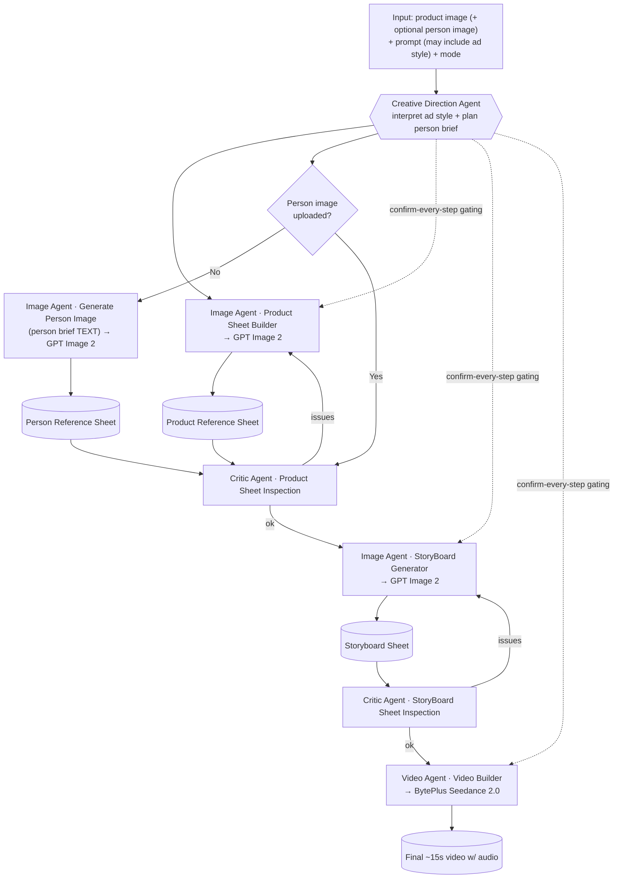

# AI Product Ad Video Generator — SPEC

> Living architecture document **and** progress tracker. The **Build Status** and **Progress Log** sections record what is built. Keep them current as work lands.

---

## 1. Overview

Turns a **product image** (required) + an **optional person image** + a **text prompt** into a finished **advertisement video with audio** — a single **~15-second** clip or a merged **30/45/60-second** clip, chosen per run. The ad can be **any style** the user asks for — UGC, inspirational, cinematic, minimalist, luxury, comedic, etc. Agents read the user's intent and adapt; nothing assumes UGC.

Pipeline: **images → storyboard → video**, driven by cooperating AI agents that each carry their own skills and prompts. A Creative Direction Agent orchestrates the whole flow and propagates the requested ad style to every downstream agent. A Critic Agent validates artifacts and triggers regeneration. The final step sends the storyboard scene plan (as text) + the clean product/person reference sheets to Seedance 2.0 (via BytePlus). The 15s path produces **one** clip with native audio (no per-scene building, no separate audio step); 30/45/60s runs generate N such clips and **merge** them into one final video. After a run completes, the video can be edited in a client-side editor (see [apps/api/docs/video-editor.md](apps/api/docs/video-editor.md)).

---

## 2. Goals & Non-Goals

### Goals

- Accept product image (+ optional person image) + free-text prompt that **may** specify ad type/style/vibe.
- Two run modes: **Automatic** (end-to-end, no gating) and **Confirm-every-step** (user confirms each step).
- **Auto-checking in both modes**: Critic Agent validates each artifact and regenerates (full or partial) on issues.
- Style-agnostic: agents interpret requested style and adapt prompts/skills accordingly.
- Produce a single **~15s** ad video **with audio** as the final deliverable.
- Persist all artifacts + run state so a job survives a page refresh.

### Non-Goals

- ❌ Per-scene / per-keyframe video generation.
- ❌ Separate audio generation or an audio↔video merge step.
- ❌ Multiple output videos per run.
- ❌ Real-time / timeline video editing **built in-house** (we don't build an editor).
- ❌ Auth in early phases (deferred to **F8**).

> **Update:** a post-completion **video editor** (img.ly CE.SDK, third-party, client-side) now
> provides timeline editing on the finished `final_video`. The system still builds no editor of its
> own, and an edit saves a new `edited_video` asset on the **same** run (not a new run/output). See
> [apps/api/docs/video-editor.md](apps/api/docs/video-editor.md).

---

## 3. Glossary

| Term                            | Meaning                                                                                                                      |
| ------------------------------- | ---------------------------------------------------------------------------------------------------------------------------- |
| **Scene**                       | A complete moment or section in the video.                                                                                   |
| **Keyframe**                    | A single important visual moment inside a scene.                                                                             |
| **Reference Sheet**             | A composite image of an entity (product or person) showing multiple views, used to keep downstream generations consistent.   |
| **Storyboard / Keyframe Sheet** | A single sheet describing the ordered scenes (camera/angle, action/movement, description) in the chosen ad style.            |
| **Run (Job)**                   | One end-to-end generation attempt for a project. The DB row is the state machine.                                            |
| **Step**                        | A discrete unit of the pipeline (product sheet, person sheet, product inspection, storyboard, storyboard inspection, video). |
| **Skill**                       | A named capability of an agent = a prompt module + a function the agent invokes.                                             |
| **Mode**                        | `automatic` or `confirm` — controls gating, not the auto-checks.                                                             |
| **Ad Style**                    | The interpreted creative direction (UGC / cinematic / minimalist / …) propagated to all agents.                              |

---

## 4. Architecture

### Agents, skills, services

| Agent                                       | Powered by                                                            | Skills                                                                                                                                                                                 |
| ------------------------------------------- | --------------------------------------------------------------------- | -------------------------------------------------------------------------------------------------------------------------------------------------------------------------------------- |
| **Creative Direction Agent** (orchestrator) | OpenAI (LLM)                                                          | Holds all guidelines + workflow logic. Decides agent order for both modes, interprets requested ad style, propagates it downstream, drives the run state machine, applies mode gating. |
| **Image Generation Agent**                  | OpenAI — **GPT Image 2** for images, OpenAI LLM for prompt building   | `Product Sheet Builder`, `Generate Person Image`, `StoryBoard Generator`                                                                                                               |
| **Critic Agent** (QA/validation)            | OpenAI (LLM, vision)                                                  | `Product Sheet Inspection` (full or localized partial regen), `StoryBoard Sheet Inspection`                                                                                            |
| **Video Generation Agent**                  | **BytePlus ModelArk — Seedance 2.0** (`dreamina-seedance-2-0-260128`) | `Video Builder`                                                                                                                                                                        |

#### Skill detail

- **Product Sheet Builder** — decides the ad framework/hook from the product **and** the user's requested style, builds the final image prompt, calls GPT Image 2 → **Product Reference Sheet** (front, three-quarter, side, rear).
- **Generate Person Image** — **only** when no person image was uploaded. Runs **in parallel** with the Product Sheet Builder, driven by a product-derived **person brief** (TEXT) planned upstream from the uploaded product image — it never reads the product sheet image. Defines the kind of person + how they fit the product/ad style, then generates the **Person Reference Sheet**.
- **StoryBoard Generator** — takes the product sheet (+ person sheet if present) → **Storyboard/Keyframe Sheet** of scenes, each with camera/angle, action/movement, scene description, consistent with the ad style.
- **Product Sheet Inspection** — validates the product sheet; regenerates the whole sheet, or **only the localized part**, when the problem is local.{"type":"excalidraw/clipboard","elements":[{"id":"GifwvUiE","type":"text","x":-540.8864558616417,"y":-304.77926271622357,"width":95.03242492675781,"height":35,"angle":0,"strokeColor":"#1e1e1e","backgroundColor":"transparent","fillStyle":"hachure","strokeWidth":1,"strokeStyle":"solid","roughness":1,"opacity":100,"groupIds":[],"frameId":null,"index":"aG","roundness":null,"seed":1846301990,"version":191,"versionNonce":2119462586,"isDeleted":false,"boundElements":[],"updated":1781098310329,"link":null,"locked":false,"text":"Parallel","fontSize":28,"fontFamily":5,"textAlign":"left","verticalAlign":"top","containerId":null,"originalText":"Parallel","autoResize":true,"lineHeight":1.25,"rawText":"Parallel","hasTextLink":false}],"files":{}}
- **StoryBoard Sheet Inspection** — validates the storyboard sheet; regenerates if problems.
- **Video Builder** — sends the storyboard scene plan (text) + clean product/person reference sheets to Seedance 2.0 (via BytePlus) → a ~15s clip with native audio. For 15s runs that clip is the final output; for 30/45/60s runs it's one of N segment clips later joined by the **merge** step.

### End-to-end flow



> Mode controls only the **gating** (the dotted lines): in `confirm` the run pauses at `awaiting_confirmation` after each step. Auto-checks (Critic) run in **both** modes.

### Execution model

- **Background worker + polling.** A Hono route enqueues a `run`; a background worker loop advances it step-by-step. The frontend polls a status endpoint. The `runs` row is the authoritative state machine, so a refresh never loses progress.
- **Assumption:** worker is an in-process loop in `apps/api` for F0–F7; revisit a dedicated queue (e.g. pg-boss) if scaling demands it.

### Agent/Skill code layout

Agents are **code, not a framework**. Each **skill** = a prompt module (`prompt.ts`) + a function (`index.ts`) of shape `(ctx: SkillContext, input) => Promise<SkillResult<T>>`. Provider adapters (OpenAI / video) are **injected via `SkillContext`**, never imported inside a skill — keeping skills swappable and testable.

```
apps/api/src/agents/
  types.ts                 SkillContext { runId, adStyle, openai }, SkillResult<T>
  json.ts                  parseJsonObject — pull strict JSON from an LLM reply
  image/                   Image Generation Agent (GPT Image 2) — F4
    index.ts               agent barrel (the 3 skills)
    persist.ts             shared: upload → assets row → artifact row (in a tx)
    product-sheet/         { prompt.ts, index.ts }  Product Sheet Builder
    person-image/          { prompt.ts, index.ts }  Generate Person Image
    storyboard/            { prompt.ts, index.ts }  StoryBoard Generator
    verify.ts              standalone skill runner (no worker until F7)
  critic/                  Critic Agent — F5 (reserved home)
  video/                   Video Generation Agent — F6 (reserved home)
  creative-direction/      Creative Direction Agent (orchestrator) — F7 (reserved home)
```

Each agent's prompts are written **inside that agent's own feature** (F4 Image, F5 Critic, F6 Video, F7 Creative Direction) — prompt and function are one unit, not a separate phase. The Creative Direction Agent (F7) wires the skills into the run state machine; until then skills are invoked directly via `verify.ts`.

---

## 5. Data Model & Artifact Schemas

**ORM:** Drizzle over **Supabase Postgres**. **Validation:** Zod mirrors live in `packages/shared` and are reused by API + frontend. **Files:** Supabase Storage; DB rows hold object path + URL.

### Tables

#### `projects`

| Field     | Type          | Notes                |
| --------- | ------------- | -------------------- |
| id        | uuid PK       |                      |
| ownerId   | uuid nullable | null until Auth (F8) |
| title     | text          |                      |
| createdAt | timestamptz   |                      |

#### `runs` (generation job)

| Field                 | Type                          | Notes                                                                               |
| --------------------- | ----------------------------- | ----------------------------------------------------------------------------------- |
| id                    | uuid PK                       |                                                                                     |
| projectId             | uuid FK → projects            |                                                                                     |
| prompt                | text                          | raw user prompt                                                                     |
| adStyle               | text                          | interpreted style propagated to agents                                              |
| mode                  | enum `automatic` \| `confirm` |                                                                                     |
| status                | enum                          | `queued`, `running`, `awaiting_confirmation`, `regenerating`, `completed`, `failed` |
| currentStep           | enum (see Steps)              |                                                                                     |
| error                 | text nullable                 |                                                                                     |
| createdAt / updatedAt | timestamptz                   |                                                                                     |

**Steps enum:** `product_sheet`, `person_sheet`, `product_inspection`, `storyboard`, `storyboard_inspection`, `video`.

#### `assets`

| Field       | Type           | Notes                                                                                                                                                                       |
| ----------- | -------------- | --------------------------------------------------------------------------------------------------------------------------------------------------------------------------- |
| id          | uuid PK        |                                                                                                                                                                             |
| runId       | uuid FK → runs |                                                                                                                                                                             |
| kind        | enum           | `product_upload`, `person_upload`, `product_sheet`, `person_sheet`, `storyboard_sheet`, `storyboard_master`, `final_video`, `segment_video`, `edited_video`, `editor_scene` |
| storagePath | text           | Supabase Storage object path                                                                                                                                                |
| url         | text           | public or signed URL                                                                                                                                                        |
| mime        | text           |                                                                                                                                                                             |
| meta        | jsonb          | width/height/duration/provider info                                                                                                                                         |
| createdAt   | timestamptz    |                                                                                                                                                                             |

#### `step_events` (audit trail)

| Field     | Type           | Notes                                       |
| --------- | -------------- | ------------------------------------------- |
| id        | uuid PK        |                                             |
| runId     | uuid FK → runs |                                             |
| step      | enum (Steps)   |                                             |
| status    | text           | started / passed / failed / regenerated     |
| payload   | jsonb          | Critic diagnostics, prompts used, decisions |
| createdAt | timestamptz    | drives progress timeline                    |

### Canonical artifacts

#### Product Reference Sheet — `product_reference_sheets`

4 product views in one composite sheet.

| Field      | Type                               | Notes                                                                        |
| ---------- | ---------------------------------- | ---------------------------------------------------------------------------- |
| id         | uuid PK                            |                                                                              |
| runId      | uuid FK                            |                                                                              |
| assetId    | uuid FK → assets (`product_sheet`) |                                                                              |
| views      | jsonb                              | `{ front, threeQuarter, side, rear }` — each: crop/region descriptor + notes |
| promptUsed | text                               | final GPT Image 2 prompt                                                     |
| status     | text                               | `draft` / `approved` / `rejected`                                            |

#### Person Reference Sheet — `person_reference_sheets`

Multiple views + person details, costume/style, color reference. Only created when no person uploaded.

| Field         | Type                              | Notes                                            |
| ------------- | --------------------------------- | ------------------------------------------------ |
| id            | uuid PK                           |                                                  |
| runId         | uuid FK                           |                                                  |
| assetId       | uuid FK → assets (`person_sheet`) |                                                  |
| views         | jsonb                             | multiple view descriptors                        |
| personDetails | jsonb                             | `{ demographics, costumeStyle, colorReference }` |
| promptUsed    | text                              |                                                  |
| status        | text                              | `draft` / `approved` / `rejected`                |

#### Storyboard / Keyframe Sheet — `storyboard_sheets`

Ordered scenes, each with camera/angle, action/movement, description, in the chosen ad style.

| Field      | Type                                  | Notes                                                                     |
| ---------- | ------------------------------------- | ------------------------------------------------------------------------- |
| id         | uuid PK                               |                                                                           |
| runId      | uuid FK                               |                                                                           |
| assetId    | uuid FK → assets (`storyboard_sheet`) |                                                                           |
| scenes     | jsonb[]                               | each: `{ index, cameraAngle, actionMovement, sceneDescription, adStyle }` |
| promptUsed | text                                  |                                                                           |
| status     | text                                  | `draft` / `approved` / `rejected`                                         |

#### Final Video — `videos`

Single ~15s clip with audio from Seedance 2.0 (via BytePlus). No merge.

| Field        | Type                             | Notes                                 |
| ------------ | -------------------------------- | ------------------------------------- |
| id           | uuid PK                          |                                       |
| runId        | uuid FK                          |                                       |
| assetId      | uuid FK → assets (`final_video`) |                                       |
| durationSec  | numeric                          | ~15                                   |
| hasAudio     | boolean                          | true (native Seedance audio)          |
| providerMeta | jsonb                            | provider, model slug, task id, params |
| status       | text                             | `processing` / `completed` / `failed` |

---

## 6. External Integrations

| Service      | Used for                                                                               | Client                                                 | Key (env)                                                                        |
| ------------ | -------------------------------------------------------------------------------------- | ------------------------------------------------------ | -------------------------------------------------------------------------------- |
| **OpenAI**   | GPT Image 2 (all image artifacts) **and** agent LLM reasoning/prompt-building/critique | `openai` SDK                                           | `OPENAI_API_KEY`                                                                 |
| **BytePlus** | Seedance 2.0 video (storyboard plan + reference sheets → ~15s video w/ audio)          | REST (`POST /api/v3/contents/generations/tasks` async) | `BYTEPLUS_API_KEY`                                                               |
| **Supabase** | Postgres DB (via Drizzle) + Storage + Auth (F8)                                        | `@supabase/supabase-js` + `postgres`/Drizzle           | `SUPABASE_URL`, `SUPABASE_ANON_KEY`, `SUPABASE_SERVICE_ROLE_KEY`, `DATABASE_URL` |

**Config location:** env loaded + Zod-validated in `apps/api/src/config` (server secrets) and `apps/web` env (public-safe vars only). Provider calls live behind a thin **adapter boundary** (`apps/api/src/providers/{openai,byteplus}`) so the concrete model/provider is swappable without touching agent logic. BytePlus is the sole video provider; it speaks the async `POST /api/v3/contents/generations/tasks` → poll task id REST shape.

**Invocation shape:**

- GPT Image 2 — Image Agent builds a prompt (via LLM skill) → image generation call → store composite sheet to Supabase Storage → row in `assets` + artifact table.
- Seedance 2.0 — Video Builder submits the storyboard scene plan (text) + the clean product/person reference sheets (the annotated storyboard sheet is NOT sent as an image, so its panel numbers/arrows can't leak into the clip) as a video task to BytePlus, polls until complete, downloads the ~15s video to Supabase Storage.

---

## 7. Mode Behavior

|                      | Automatic                               | Confirm-every-step                                                                                                           |
| -------------------- | --------------------------------------- | ---------------------------------------------------------------------------------------------------------------------------- |
| Step gating          | None — worker advances straight through | Worker sets `awaiting_confirmation` after each step's artifact is produced + auto-checked; waits for user `confirm`/`reject` |
| Auto-checks (Critic) | ✅ runs, auto-regenerates on issues     | ✅ runs, auto-regenerates on issues (same)                                                                                   |
| User actions         | Cancel only                             | Confirm step / Reject step (→ regenerate) / Cancel                                                                           |
| Resume after refresh | Worker continues                        | Run sits in `awaiting_confirmation`; UI re-renders the pending step                                                          |

State machine: `queued → running → (regenerating ⇄ running) → [awaiting_confirmation only in confirm mode] → … → completed | failed`. Critic-driven regeneration is independent of mode and bounded by a retry cap (see Open Questions).

---

## 8. Open Questions / Assumptions

**Open questions**

- Exact OpenAI model id/endpoint mapped to "GPT Image 2", and whether a reference "sheet" is **one composite image** (multiple views in a grid) vs several separate images. **Assumption:** one composite sheet image per artifact.
- Exact **Seedance 2.0 model slug/region** on BytePlus, whether it accepts multiple reference images (product + person sheets) alongside the text prompt, and confirmation of **native audio** output at the requested ~15s duration (resolved in code: `dreamina-seedance-2-0-260128`, async `POST /api/v3/contents/generations/tasks`, `generate_audio:true`; live run pending).
- Agent runtime: OpenAI Responses/Chat + tool-calling vs Assistants API; how "skills" map to code. **Assumption:** each skill = a prompt module + a function, orchestrated in code by the Creative Direction Agent.
- Worker host: in-process loop vs separate queue process (pg-boss/BullMQ). **Assumption:** in-process loop in `apps/api` through F7.
- Regeneration **retry caps / cost guards** — max auto-regens per step before failing the run.
- Storage **bucket layout, signed-URL strategy, retention** policy.
- Whether projects are reusable across many runs or 1 run = 1 project in the MVP. **Assumption:** project can hold multiple runs; UI starts with one run per project.

**Assumptions** (recorded above inline) — all marked **Assumption:** are working defaults, revisit as needed.

---

# Build Status

> Per-feature status of the F0–F8 build order. "Done" = code complete and locally verified (typecheck/build/route smoke tests) unless noted. Live OpenAI/BytePlus end-to-end verification is still outstanding across the agent pipeline (F4–F7).

## F0 — Project scaffolding & config — **Done**

Deps added (`zod`, `drizzle-orm`/`drizzle-kit`/`postgres`, `@supabase/supabase-js`, `dotenv` on api; `framer-motion` on web). Per-app env files (`apps/api/.env(.example)` server secrets, `apps/web/.env.local(.example)` `NEXT_PUBLIC_*` only); real files gitignored. `apps/api/src/config` Zod-validates server env (fail-fast); `apps/web` exposes only public vars. Shared Zod enums in `packages/shared`. Provider adapter stubs under `apps/api/src/providers/{openai, byteplus}`. `pnpm dev`/`typecheck`/`lint` green.

## F1 — Database schema design — **Done**

Drizzle schema for all 8 tables (`projects`, `runs`, `assets`, `step_events`, `product_reference_sheets`, `person_reference_sheets`, `storyboard_sheets`, `videos`) in `apps/api/src/db/schema.ts`; 5 native `pgEnum`s sourced from shared Zod enums; PKs `gen_random_uuid()`, FKs `ON DELETE cascade`, FK + `runs.status` indexes, CHECKs on `step_events.status`/`videos.status`/`videos.duration_sec`. `drizzle.config.ts` + db scripts; initial migration applied to live Supabase. DB client singleton in `apps/api/src/db`. Seed helper. RLS enabled on every table (locked down / service-role-only; owner policies deferred to F8). Docs in `apps/api/docs/`.

## F2 — Frontend UI shell + TanStack Query — **Done**

Marketing landing (`/`), studio create form (`/studio`), run progress view (`/studio/[runId]`). shadcn/ui (new-york), next-themes, lucide-react, oklch token theme with violet→fuchsia→cyan brand accent. Shared DTO schemas in `packages/shared`. Create = structured form (image dropzones + preview, segmented mode field, prompt textarea). Progress = vertical timeline/stepper with per-step status, artifact cards w/ zoom, confirm-bar gating in confirm mode, terminal video/error states; Framer Motion throughout w/ `prefers-reduced-motion`. **No global store** (zustand removed): form draft = local state; server state = TanStack Query polling `GET /runs/:id`, stopping at terminal status and pausing at `awaiting_confirmation`.

## F3 — Backend API (Hono) + Zod — **Done**

Hono backend in `apps/api`: `app.ts` (CORS, `/health`, mounts `/runs`, error/notFound sinks). Routes in `src/routes/runs.ts`: `POST /runs` (multipart upload + validation + Storage upload + row inserts), `GET /runs/:id`, `GET /runs/:id/artifacts`, `POST /runs/:id/{confirm,reject,cancel}`. Zod validation on every route via shared schemas. Helpers: `lib/errors.ts` (single JSON error shape), `lib/storage.ts` (service-role Supabase client, public `ugc-assets` bucket), `lib/mappers.ts` (sole DB→DTO exit, never emits `storagePath`), `lib/runs.ts`. Public bucket for stable URLs (signed URLs deferred).

## F4 — Image Generation Agent + skills (GPT Image 2) — **Done (code; live verification pending)**

Image Agent + 3 skills under `apps/api/src/agents/image/`. Convention: each skill = `prompt.ts` + `index.ts` `(ctx, input) => SkillResult<T>`, OpenAI adapter injected via `SkillContext`. OpenAI provider (`providers/openai/index.ts`): `chat()` (vision-ready) + `generateImage()` (`images.generate` vs `images.edit` for ref→sheet); model ids in `providers/openai/constants.ts`. Skills: **Product Sheet Builder**, **Generate Person Image** (only when no person uploaded), **StoryBoard Generator**. All sheets = single composite images. Shared `agents/persist.ts` (upload → `assets` row → artifact row in one tx) and `agents/json.ts`. Ad style threaded opaque via `ctx`. Invoked standalone via `agents/image/verify.ts`. **Not yet run against live OpenAI image API.**

## F5 — Critic Agent + skills — **Done (code) · PARKED (off by default, not in UI)**

> **Parked 2026-06-09** (`chore/disable-critic-default`): the Critic is disabled by default and removed from the studio UI — code retained but dormant, gated by `runs.criticEnabled` (default `false`). Not a current focus; do not invest here until re-prioritized. See Progress Log.

Critic Agent under `apps/api/src/agents/critic/`. Two skills, each a single-pass inspection + inspect-and-remediate wrapper: **Product Sheet Inspection** and **StoryBoard Sheet Inspection**; inspections attach the sheet as a vision image and parse a strict `InspectionVerdict`. Critic does NOT own `run.status` (F7's job) — returns `CriticVerdict { outcome, attempts, finalArtifact, lastVerdict }`. Plumbing: verdict types, `CRITIC_RETRY_CAP = 1`, `events.ts` `writeStepEvent` (first writer of `step_events`), draft→approved/rejected status, generic remediate engine, localized product-view regen. Retry cap = 1; inspections cover product + storyboard only; localized partial regen = product sheet only (storyboard always full regen). Full regen re-invokes the F4 producer steered by an additive `critique?` field. Invoked standalone via `agents/critic/verify.ts`. **Not yet run against live OpenAI vision.**

## F6 — Video Generation Agent + Video Builder (Seedance 2.0) — **Done (code; live verification pending)**

Video Agent under `apps/api/src/agents/video/`. Provider boundary: shared `VideoProvider` interface + types in `providers/video.ts` (`submitVideo`/`pollVideo`). **BytePlus is the sole adapter** (`providers/byteplus/index.ts`) — async `POST /api/v3/contents/generations/tasks` (Bearer key, body `{model, content:[text, image_url…], duration, resolution:"720p", aspect_ratio:"16:9", generate_audio:true}`) → `{id}`; polling `GET …/tasks/{id}` maps `succeeded→completed`, `failed|cancelled|expired→failed`, else `processing`, reading `content.video_url`. `createVideoProvider()` in `providers/index.ts` returns the BytePlus provider. **Skill: Video Builder** composes ONE cinematic motion/audio prompt from the storyboard scenes (text plan), submits the clean product/person reference sheets (the annotated storyboard sheet is NOT sent as an image — its panel numbers/arrows would leak into the clip) + prompt + optional clean first frame, polls until terminal/timeout, downloads the mp4, persists via shared `persistSheet` (`kind:"final_video"`) → `assets` + `videos` row (`providerMeta:{provider,model,taskId,videoPrompt}`). Config: `BYTEPLUS_API_KEY`/`BYTEPLUS_BASE_URL`/`BYTEPLUS_VIDEO_MODEL` (`dreamina-seedance-2-0-260128`)/`BYTEPLUS_POLL_INTERVAL_MS`/`BYTEPLUS_POLL_TIMEOUT_MS`. `SkillContext` gains `video: VideoProvider`. **Face-asset registration**: person/face reference sheets are registered in BytePlus's asset library (AK/SK-signed OpenAPI) and referenced as `asset://<id>` so Seedance's real-human face filter accepts them; product sheets stay raw `image_url`. See `apps/api/docs/byteplus-face-assets.md`. Invoked standalone via `agents/video/verify.ts`. **Not yet run against live BytePlus.**

## F7 — Creative Direction Agent orchestration + modes — **Done (code; live end-to-end pending)**

CDA orchestrator + in-process background worker under `apps/api/src/agents/creative-direction/`. (1) **Style skill** `interpret-style` distils the raw prompt into a concise style-agnostic `adStyle` brief, run once on leaving `queued`, persisted to `runs.adStyle`, threaded into every downstream skill via `ctx.adStyle`. (2) **State machine** `orchestrator.ts` (`driveRun`) + **worker** `worker.ts` (`startWorker`). Fixed pipeline in `plan.ts`: `product_sheet → [person_sheet if no person] → product_inspection → [gate] → storyboard → storyboard_inspection → [gate] → video → completed`. Convention: `currentStep` = last completed step; `status` drives the worker (`queued`→interpret; `running`→`nextStep`; `regenerating`→re-run stage; `awaiting_confirmation`/`completed`/`failed` terminal). Existing confirm/reject/cancel routes work unchanged. Gating (confirm mode only) pauses after each validated stage; Critic auto-checks run in both modes. Resumable: each step persists state + reloads inputs from DB. Worker = recursive-`setTimeout` poll, single-flight per `runId`, gated by `WORKER_ENABLED`. **Outstanding: full live OpenAI + BytePlus end-to-end run in both modes (automatic + confirm) — not yet verified.**

## F8 — Auth (Supabase) + hardening + cleanup — **Not started (deferred to last)**

Supabase Auth sign-in; set `projects.ownerId` and scope runs/artifacts; owner-based RLS policies; secret review + rate limiting + input hardening; cleanup, error states, asset retention policy.

## Post-generation video editor — **Shipped (outside F0–F8)**

A `completed` run's `final_video` can be edited in a client-side editor (img.ly CE.SDK) at `/studio/[runId]/edit`; the export saves as `edited_video` (+ `editor_scene`) via `POST /runs/:id/edited-video`. Post-pipeline (the worker never touches `completed` runs), non-destructive (original `final_video` kept), templates/stock content served by the img.ly CDN (not our backend). Full flow, storage, and config in [apps/api/docs/video-editor.md](apps/api/docs/video-editor.md); implementation notes in the 2026-06-12 Progress Log entry.

## Any-Type Ad Expansion — **In progress (chunked roadmap, 2026-06-19)** · outside F0–F8

Expand the generator from 2 ad types (`ugc`/`inspirational`) to **ANY ad type** — auto-detected from the user's free-text prompt, with an **optional dropdown override** (Auto-detect by default; an explicit pick **locks** the type) — restructured around an **ad-type registry + hook registry + look families** so adding a type is purely additive. Plus: swap reasoning/vision from **gpt-4.1 → Claude Sonnet 4.6 via OpenRouter** (image gen stays `gpt-image-2`); fix two current-pipeline state-machine bugs (**Step 0**); and surface the detected ad type + hooks-per-scene + selected options in the run view (**Chunk K**). Research lives in [`research/`](research/); full plan + cross-cutting hazards (H1–H12) in `.claude/plans/i-have-already-did-streamed-candy.md`.

**Rules:** one chunk = one `feat/…` branch off `main`; implement **one checkbox at a time**, the user manually tests each, commit + PR only on their OK. **Backend first, then frontend**, per chunk. **No critic work** (parked). Auto-detect is the **default**; the dropdown is an **optional override** (Chunk J). Dependency order: **Step 0 → A → B → (C + D) → E → F → G → J → K → H → I**.

> Read-first per chunk: `research/00` = ad taxonomy (16 types, 4 look families, asset matrix); `research/01` = hook library (16 hooks, roles, exclusive sets); `research/02` = detector design (rubric, clamp, reconcile, eval fixtures); `research/04`+`research/05` = Seedance/gpt-image per-type prompt fragments; `research/03-prompt-restructure-and-skills/` = registry+skill architecture (types/registry/compose/sync-test/SKILL.md).

### Step 0 — Pipeline state-machine fixes (backend → frontend) — `feat/pipeline-state-fixes`

Fix two current-pipeline bugs + truthful stepper. **Bug 1:** cancel set `status="failed"` with no step*event, so the UI painted the \_passed* storyboard step "failed" and hid its (existing) artifact. **Bug 2:** `nextStep` returned `video` after `storyboard` regardless of pass/fail; the video precondition checked only asset existence — a failed/empty storyboard could still render a video. Touches: `routes/runs.ts` (cancel), `creative-direction/orchestrator.ts`, `agents/events.ts`; `components/studio/run/{run-meta.ts,step-timeline.tsx}`.

- [x] **Bug 2 (backend):** guard `video` — only runs when `storyboard`'s latest step_event is `passed` AND scenes are non-empty (`latestStepEventStatus`). Else throws → `failRun`.
- [x] **Bug 1 (backend):** cancel now closes only IN-FLIGHT steps (`closeInFlightStepsOnCancel`) — a `started`-without-terminal step gets a `failed` event; completed (`passed`) steps keep their status + artifact. Cancel still tagged `errorCode="RUN_CANCELLED"`.
- [x] **Bug 1 (frontend):** `stepState()` is now event-authoritative — step events override run-level status, so a passed step stays `done` (with artifact) after a cancel/fail, and a cancelled in-flight step reads `failed`.
- [x] **Bug 1 (frontend):** artifact shows whenever it EXISTS (gated on asset presence, not `done`/`awaiting`) — storyboard stays visible on a cancelled run.
- [x] **Step-sync:** stepper tracks true running step via events; cancel already distinguished at the run banner (`RUN_CANCELLED`).
- [x] PAUSE — user tested (normal run · cancel-after-storyboard · forced storyboard failure) + approved 2026-06-19 → committed + PR.

### Chunk A — Provider swap: Claude Sonnet 4.6 (OpenRouter) as reasoning/vision default — `feat/claude-reasoning-default`

Read first: `research/02`. Touches: `providers/openai/{index.ts,constants.ts}`, `config/index.ts` + `.env.example`, `agents/json.ts`, `apps/api/docs/{system-context,agents-and-skills-io,pipeline}.md`. Full flip now (all reasoning/vision → Claude at once, Zod+retry guards JSON-mode sites).

- [x] Verify the live OpenRouter Claude slug (`GET …/v1/models`); record exact id. No code change. → `anthropic/claude-sonnet-4.6` confirmed live 2026-06-19 (constant already correct; `anthropic/claude-sonnet-4.5` available as fallback).
- [x] Promote both model ids to env-overridable config (`OPENAI_CHAT_MODEL`/`OPENROUTER_CLAUDE_MODEL`, defaults = current); `constants.ts` reads from `env`.
- [x] Flip default backend to Claude (`const backend = opts?.backend ?? "claude"`); gpt-4.1 fallback when `OPENROUTER_API_KEY` missing or `backend:"openai"`.
- [x] JSON strategy (H3): kept `wantJson && !useClaude`; `parseJsonObject` already robust (fence-strip + outermost-brace slice + control-byte sanitize) — handles Claude replies.
- [x] Audited the 12 non-critic `chat()` sites — all parse via shared `parseJsonObject`; `describe-product` + `derive-person-brief` already run on Claude this way (stable), so the 10 flipped sites are covered.
- [x] Zod `.safeParse` guards — **DEFERRED (intentional):** not needed; parseJsonObject + the 2 proven-Claude sites cover it. Per-site Zod lands with the detector in Chunk E. (No code change.)
- [x] Updated the 3 docs (`system-context.md`, `agents-and-skills-io.md`, `pipeline.md`) → reasoning/vision = Claude Sonnet 4.6 via OpenRouter (gpt-4.1 fallback); image = gpt-image-2.
- [x] DONE — user-tested + merged into `dev` locally (commit 41599e3). `pnpm typecheck` green.

### Chunk B — Schema foundation: `adType` → text + detector columns — `feat/adtype-open-schema`

Read first: `research/00`, `research/02`. Touches: `packages/shared/src/{enums.ts,dto.ts}`, `db/schema.ts`, `db/migrations/`, `routes/runs.ts`.

- [x] Added open `adTypeIdSchema` + `adTypeSourceSchema` (`enums.ts`); legacy `AdType` union kept.
- [x] Migration `0018`: `runs.ad_type` enum → `text` (`USING "ad_type"::text`), `DROP TYPE ad_type`. Applied local; 53 legacy rows (33 ugc + 20 inspirational) survived.
- [x] Same migration adds nullable `hooks jsonb`, `ad_type_confidence real`, `detector_meta jsonb`, `ad_type_source text`. Applied + verified via psql.
- [x] `schema.ts`: dropped `adTypeEnum`, `ad_type`→`text`, added the 4 columns. Coerced `buildCtx` (+ 3 verify scripts) so `SkillContext.adType` stays the 2-value enum until Chunks C/E. Typecheck green.
- [x] `dto.ts`: `runSchema.adType` → `adTypeIdSchema`; added `adTypeSource` (base) + `hooks`/`adTypeConfidence`/`detectorMeta` (detail, permissive nullable — tightened in E).
- [x] run-mapper (`mappers.ts`) + `loadRunList` surface `adType`/`adTypeSource` (+ detector fields on detail). Typecheck green.
- [x] PAUSE — user-tested (existing run loads + fresh `ugc` run completes) + approved 2026-06-19 → committed onto `dev`.

### Chunk C — Ad-type registry + look families (legacy defs verbatim) — `feat/ad-type-registry-foundation`

Read first: `research/00` + `ai-ad-gen` `font-registry.ts` pattern. Touches (new `apps/api/src/agents/ad-types/`): `types.ts`, `registry.ts`, `fragments/{looks,shared}.ts`, `defs/{testimonial,brand-story}.ts`.

- [x] `types.ts`: `AdTypeDef`/`FragmentSet`/`FragmentCtx`/`LookStrategy`/`HookSelection`/`AssetPolicy`/closed `LookFamily`(4) + `FRAGMENT_SEAMS`(10)/`LOOK_FAMILIES`. Typecheck.
- [x] `registry.ts`: `REGISTRY` from `ALL_DEFS`, `getAdType()` with `LEGACY_ALIASES` + `FALLBACK_AD_TYPE_ID="brand-story"` (warns + falls back, never throws). Smoke. Re-exports the shared `adTypeIdSchema` (no second copy).
- [x] `fragments/looks.ts`: `ugc_authentic`+`cinematic_polished` keyframeLook VERBATIM from storyboard; other LOOK seams `[]` for the two legacy looks (no inline legacy ternary); authored `graphic_text`+`demo_clean` (4 seams each). Typecheck.
- [x] `defs/testimonial.ts` (=`ugc`): `ugc_authentic`, product opt/person req, `legacyMapping:"ugc"`, verbatim typeBlock/speaker/voice/audio/narrative seams.
- [x] `defs/brand-story.ts` (=`inspirational`): `cinematic_polished`, both optional, `legacyMapping:"inspirational"`, verbatim seams.
- [x] Register both in `ALL_DEFS`; verify alias resolution + `allAdTypeIds()`. Typecheck + smoke (ugc→testimonial, inspirational→brand-story, unknown→fallback). `.gitignore` un-ignores `.claude/skills/ad-type-*/`.
- [x] DONE — typecheck (all pkgs) + registry smoke green; no runtime change. Merged into `dev` locally (no per-chunk PR).

### Chunk D — Hook registry + composition engine — `feat/hook-registry-compose`

Read first: `research/01`, `research/02` (id map). Touches (new `ad-types/hooks/`): `registry.ts`, `hook-defs.json`, `compose.ts`, `ad-types/__tests__/`.

- [x] `hook-defs.json` (16 verbatim) + `registry.ts` (`getHook` throws on unknown, `hasHook`, `allHookIds`, `hookDefaultRole` from `VISUAL_LEAD_IDS`). Unit: 16 kebab ids + 6 visual-leads. JSON via `with { type: "json" }` + `resolveJsonModule`.
- [x] Placeholder→canonical id map (`pain_point`→`problem-solution`, `transformation`→`before-after`, `warning`→`negativity-bias`, `unboxing_reveal`→folded `[curiosity-gap, demonstration]`, generic snake→kebab fallback). `social_proof`→`social-proof` (the type-aware "use `testimonial`" nuance is the detector's job in E). Unit.
- [x] `resolveHooks` (a) canonicalize → drop unknown + not-in-`allowedHooks`, dedup. Unit.
- [x] (b) asset guardrail (strip testimonial/confession w/o person; demonstration w/o product). Unit.
- [x] (c) `EXCLUSIVE_SETS` collapse to higher scorer (the 5 sets). Unit.
- [x] (d) `score()` (+100 default, +confidence·10, +1 visual_lead) → top 2; (e) roles (one visual-lead + optional overlay, never two visual-leads, empty→fallback). Unit.
- [x] `hookOpening()` → labeled visual-lead [+overlay] directive lines as `string[]` (never joined). Unit.
- [x] DONE — added **vitest** to `apps/api` (`test`/`test:watch`, `vitest.config.ts`); 15 compose/registry unit tests green; `pnpm typecheck` (all pkgs) green. Merged into `dev` locally.

### Chunk E — Detector: extend `interpretAdStyle` + worker reconcile — `feat/ad-type-detector`

Read first: `research/02` (FULL), `research/00`, `research/01`. Touches: `creative-direction/interpret-style/{prompt,index}.ts`, `ad-types/{registry.ts,menu.ts}`, `agents/orchestrator.ts`, `agents/types.ts`, `packages/shared/src/dto.ts`.

- [x] `renderAdTypeMenu()`+`renderHookMenu()` on the registry (+ static `CONFUSABLE_RULES`), derived from defs/hook catalog (`ad-types/menu.ts`). Unit. In Chunk E the type menu lists the 2 registered types; it grows automatically as Chunk H registers more.
- [x] Detector output Zod schema `adStylePlanSchema` `{adStyle,rationale?,adType,hooks,confidence,assetIntent}` (reasoning-first) in shared `dto.ts` — FORGIVING (`.catch` defaults) since Claude has no strict JSON mode. Typecheck.
- [x] Rewrote `interpret-style/prompt.ts` → single strict-JSON prompt injecting both menus + confusable rules, reasoning-first, 5 tasks, composition/guardrail rules LAST; Claude-friendly (no provider `json_schema`).
- [x] Rewrote `interpret-style/index.ts` → `chat({backend:"claude"})`, `parseJsonObject` WITH the schema, retry-once-then-fallback; returns the detected plan (clamped adType + detected hook ids + confidence + assetIntent). (Manual 3-prompt check = user's live verification.)
- [x] Safety net in `ad-types/reconcile.ts`: `clampAdType` (exact→alias→levenshtein≤2→asset-implied default) + `clampHooks` + `confidenceGate` (0.55). Unit: garbage clamps; vague defaults; gate keep/override.
- [x] Persist full result in `orchestrator.ts` to `adType`+`hooks`+`detector_meta`+`adTypeConfidence`+`adTypeSource` (honors a `"user"` lock). (Manual run-row inspection = user.)
- [x] `reconcile()`: person-required+no-person → `synthesizePerson` (no downgrade); product-required+no-product → look-preserving downgrade chain (terminal `brand-awareness`); hooks resolved vs EFFECTIVE person presence (synth keeps person-hooks). Unit (downgrade chains, synth, clamp).
- [x] Wired `SkillContext` to carry `hooks`/`hasProduct`/`hasPerson` in `buildCtx`; `buildCtx` maps the open id → legacy 2-value via the registry's `legacyMapping` so the builders behave identically until Chunk F. Typecheck.
- [x] Confirm-mode HITL: the queued block only transitions to `running`; the reference gate logic is untouched, so it still fires post-interpret. (Manual confirm-mode pause = user.)
- [x] DONE (code) — 34 ad-types unit tests green; `pnpm typecheck` (all pkgs) green. Merged into `dev` locally. NON-BREAKING: detector stores rich detection but the pipeline still runs the 2-value treatment via the legacy mapping until Chunk F. **User's live check (varied prompts: product-led / person-led / neither) is the final verification.**

### Chunk F — Replace binary `if(adType)` branches with registry fragment dispatch — `feat/registry-fragment-dispatch`

Read first: image+video branch inventory, restructure design §4, `research/04`+`research/05`. Touches: `image/storyboard/prompt.ts`, `video/prompt.ts` (delete `VOICE` map), `image/storyboard/index.ts`, `video/index.ts`, `narrative-outline/prompt.ts`.

- [x] Replaced storyboard `typeBlock` ternary → `def.fragments.storyboardTypeBlock(fctx)`. Byte-identical (regression test).
- [x] Replaced `keyframeLook` → `storyboardKeyframeLook` (delegates to the `lookBase`). Byte-identical for both legacy types.
- [x] Replaced `speaker` → `storyboardSpeakerLabel`; master-only UGC block now gated by `def.lookFamily === "ugc_authentic"`; closing-look clause → `lookBase(def.lookFamily).closingLookClause(fctx)` (new LookStrategy method). Byte-identical.
- [x] Deleted the `VOICE` map; deterministic voice routes through `def.fragments.videoVoice(fctx)`. Byte-identical (incl. a no-anchor regression that exercises it).
- [x] Replaced LLM-path branches → `videoAudioLine` + the `isUgcLook` label/speaker + presenter logic from `hasPerson`. Byte-identical.
- [x] Replaced deterministic-path branches with `videoVoice` + `isUgcLook`. Byte-identical.
- [x] Spliced `hookOpening` into storyboard scene-1 (`hookBlock`) / video first-slice (`hookDirective`) only, conditional on a resolved hook → empty (byte-identical) when none. Tested.
- [x] Re-pointed `narrative-outline` `isUgc` → `def.fragments.narrativeTreatment(fctx)` (the dormant step stays dormant). Byte-identical (regression test).
- [x] Removed the `AdType` union from `SkillContext`/the 3 builders; `SkillContext.adType` is now the OPEN id; `buildCtx` passes `run.adType` straight through (dropped the legacy coercion); added `ad-types/fragment-ctx.ts` `buildFragmentCtx`. Typecheck green.
- [x] DONE (code) — 51 ad-types unit tests green incl. **14 byte-identical regression assertions** (storyboard/video-LLM/video-deterministic/narrative × ugc/inspirational, anchor + no-anchor) captured from the pre-refactor builders; `pnpm typecheck` (all pkgs) green. Merged into `dev` locally. **User's live 15s ugc + inspirational run is the final confirmation** (now each gets a hook opening in scene 1 — an intended addition, not a regression).

### Chunk G — Conditional product/person step-skipping by asset policy — `feat/conditional-asset-steps`

Read first: `research/00`, `research/02`. Touches: `creative-direction/plan.ts` (`firstStep`/`nextStep`/`gateForNext`/`genStepForRevise`), `agents/orchestrator.ts`, registry `assetPolicy` (read-only).

- [ ] Thread `assetPolicy` + actual upload booleans into `nextStep`/`firstStep` (replace unused `_personUploaded`). Typecheck.
- [ ] `firstStep()`: product not required + no upload → start at `person_sheet` (or storyboard if person also skipped). Unit.
- [ ] `nextStep` product skip when `product!=="required" && !hasProductUpload`. Manual: `social-proof` no-product jumps past it.
- [ ] `nextStep` person: required+no-upload still synthesizes; not-required+no-upload skips. Manual: showcase skips, testimonial synthesizes.
- [ ] Verify `gateForNext` auto-collapses the matching confirm-mode gate for a skipped step. Confirm-mode no-asset run.
- [ ] Update `genStepForRevise` so revise on a skipped-step run targets the right step. Manual.
- [ ] PAUSE — user runs a neither-asset (brand-awareness) run + a product-only run, confirms skips → commit + PR.

### Chunk H — Per-ad-type defs + SKILL.md docs + sync test (14 new types, one at a time) — `feat/ad-type-defs`

One branch, one combined PR; pause + manually test each type before the next. Read first: `research/00`, `research/01`, `research/04`+`research/05`, restructure design §5-6. Touches: `ad-types/defs/<id>.ts`, `.claude/skills/ad-type-<id>/SKILL.md`, `ad-types/registry.ts`, `ad-types/__tests__/defs-skills-sync.test.ts`.

- [ ] FIRST: author `defs-skills-sync.test.ts` (5 invariants) + `SKILL.md` for the 2 legacy types so it passes green.
- [ ] `product-showcase` (demo_clean, product req). Sync green + manual.
- [ ] `product-demo` (demo_clean, product req). Sync green + manual.
- [ ] `before-after` (demo_clean, product req) — **+ Meta policy guard** (no weight-loss/anti-aging split-screen). Sync green + manual.
- [ ] `comparison` (demo_clean, product req) — **+ named-competitor brand-safety guard**. Sync green + manual.
- [ ] `unboxing` (ugc_authentic, product req). Sync green + manual.
- [ ] `lifestyle` (cinematic_polished, product req). Sync green + manual.
- [ ] `problem-agitate-solve` (ugc_authentic, product req). Sync green + manual.
- [ ] `founder-pov` (cinematic_polished, person req). Sync green + manual.
- [ ] `spokesperson` (cinematic_polished, person req). Sync green + manual.
- [ ] `social-proof` (graphic_text, neither). Sync green + manual (no-asset run).
- [ ] `explainer` (graphic_text, neither). Sync green + manual.
- [ ] `promo-offer` (graphic_text, neither). Sync green + manual.
- [ ] `announcement` (graphic_text, neither). Sync green + manual.
- [ ] `brand-awareness` (graphic_text, neither — canonical no-product/no-person). Sync green + manual.
- [ ] FINAL: registry has 16, `renderAdTypeMenu()` lists all 16, detector routes to each → one combined commit + PR.

### Chunk J — Ad-type selection dropdown (registry-driven; backend → frontend) — `feat/ad-type-dropdown`

Create-form dropdown: **default "Auto-detect"** + the registry's types; an explicit pick sets `ad_type_source="user"` and **locks** the type (Chunk E honors it; detector still fills adStyle + hooks). After C (list) + E (lock); auto-grows as H adds types. Touches: `routes/runs.ts` (accept `adType` + set source), a `GET /ad-types` route or shared menu, `create-run-form.tsx` (mirror `ModeToggle`), `lib/api.ts`.

- [ ] Backend: `POST /runs` accepts optional `adType` (+`auto`); store it + set `ad_type_source`. Manual: explicit-type run row.
- [ ] Expose the ad-type menu (id + displayName + whenToUse + assetPolicy) to web. Manual: hit/import it.
- [ ] Frontend: dropdown in `OptionsMenu` (default "Auto-detect" + menu types), submit `adType`. Manual: pick + create.
- [ ] Verify the lock end-to-end (explicit pick honored; "Auto" runs full detection). Manual.
- [ ] PAUSE — user confirms pick honored + Auto detects → commit + PR.

### Chunk K — Run-view UX: surface ad type + hooks-per-scene + selected options (backend → frontend) — `feat/run-view-detected-options`

Show the chosen/detected ad type (+ user-picked vs auto), the hooks used and **which scene each drives**, asset choices, mode/duration/aspect. Touches: `packages/shared/src/dto.ts` (RunDetail += `hooks`/`adTypeSource`; Scene += hook attribution), `lib/mappers.ts`; `components/studio/run/{run-view.tsx,script-panel.tsx}`.

- [ ] Backend: extend `RunDetail` (`hooks` resolved selection + `adTypeSource`) + `Scene` (hook attribution from Chunk F). Map in `lib/mappers.ts`. Typecheck.
- [ ] Frontend: registry `displayName` adType chip + "auto / you chose" badge (replaces the 2-value chip). Manual.
- [ ] Frontend: hook chips (visual-lead + overlay) + per-scene hook label in `script-panel.tsx`. Manual.
- [ ] Frontend: surface selected options (mode/duration/aspect, asset choices, synthesized-person note). Manual.
- [ ] PAUSE — user reviews a completed run, info accurate → commit + PR.

### Chunk I — Eval fixtures (detector accuracy seed) — `feat/detector-eval-fixtures`

Read first: `research/02` §6, `research/00`, `research/01`. Touches: `ad-types/__tests__/detector-eval.*`.

- [ ] Encode ≥5 prompts/type + the 4 confusable pairs, each with expected `{adType,hooks,assetIntent}`. Data-only.
- [ ] OFFLINE assertion test through `clampAdType`+`clampHooks`+`reconcile`, assert final type/hooks (no LLM call). Green.
- [ ] OPTIONAL live-LLM eval (env-flag gated, off in CI) reporting accuracy %. Manual run, record baseline in PR.
- [ ] PAUSE — user reviews offline test green + live baseline → commit + PR.

---

## Progress Log

### 2026-06-19

- **Chunk F — registry fragment dispatch landed (`feat/registry-fragment-dispatch`, merged into `dev`).** Replaced every binary `if (adType === "ugc")` branch in the prompt builders with ad-type registry dispatch (`getAdType(ctx.adType).fragments.<seam>(fctx)`); legacy `ugc`/`inspirational` ids alias-resolve to `testimonial`/`brand-story` whose fragments carry the VERBATIM legacy text, so the output is byte-identical for the two legacy types (proven by a regression fixture captured from the pre-refactor builders). **Storyboard** (`image/storyboard/prompt.ts`): `typeBlock`→`storyboardTypeBlock`, `keyframeLook`→`storyboardKeyframeLook` (look base), `speaker`→`storyboardSpeakerLabel`, master continuous-scene block now gated by `def.lookFamily === "ugc_authentic"`, closing-look clause → a new `LookStrategy.closingLookClause`. **Video** (`video/prompt.ts`): deleted the `VOICE` `Record<AdType,…>` map (its values live on `videoVoice`); LLM + deterministic paths route voice/audio through `videoVoice`/`videoAudioLine`, the "UGC-style ad"/"commercial" + "spoken"/"voiceover" labels through `isUgcLook` (look family), and presenter logic through `hasPerson`. **Narrative** (`narrative-outline/prompt.ts`): `isUgc`→`narrativeTreatment` (dormant step untouched). **Hooks:** `hookOpening` is spliced into storyboard scene-1 (`hookBlock`) and the video first time-slice (`hookDirective`), conditional on a resolved hook (empty → byte-identical when none). **Plumbing:** `SkillContext.adType` widened from the 2-value `AdType` to the OPEN id; `buildCtx` now passes `run.adType` straight through (dropped Chunk E's legacy coercion); new `ad-types/fragment-ctx.ts` `buildFragmentCtx` + `ad-types/types.ts` `FragmentCtx.hooks` made optional. **Verified:** 51 ad-types unit tests green incl. 14 byte-identical regression assertions (4 storyboard + 6 video + 2 narrative + verbatim-VOICE + 2 hook-splice) and `pnpm typecheck` (all pkgs) green. New types (Chunk H) now get their own per-type fragments automatically; the live pipeline still detects only the 2 registered types until then.
- **Chunk E — single-call ad-type/hook detector + reconcile landed (`feat/ad-type-detector`, merged into `dev`).** The `interpretAdStyle` step now classifies an ad type + 1–2 hooks alongside the `adStyle` brief, persists the rich result, and the worker reconciles it against ground-truth uploads — all NON-BREAKING (the pipeline still runs the 2-value treatment via the registry's legacy mapping until Chunk F flips consumption). **Detector:** rewrote `interpret-style/{prompt,index}.ts` → one Claude call (`backend:"claude"`, no strict JSON mode) with the registry-rendered AD TYPE + HOOK menus + confusable rules injected, reasoning-first key order, composition/guardrail rules last; parsed with the new forgiving `adStylePlanSchema` (shared `dto.ts`, every field `.catch`-defaulted) + retry-once-then-fallback so a bad reply degrades to the asset-implied default instead of failing the run. **`ad-types/menu.ts`:** `renderAdTypeMenu()`/`renderHookMenu()` derived from the registry/hook catalog (grow automatically with Chunk H) + static `CONFUSABLE_RULES`. **`ad-types/reconcile.ts` (pure, unit-tested):** `clampAdType` (exact→alias→levenshtein≤2→`assetImpliedDefault`), `confidenceGate` (0.55 coarse floor, keep low-confidence picks that share the default's look + are asset-compatible), the per-type look-preserving `DOWNGRADE_CHAIN` + `downgradeTarget` (terminal `brand-awareness`), `clampHooks`, and `reconcile` (person-required+no-person → `synthesizePerson` not downgrade; product-required+no-product → downgrade; hooks resolved vs EFFECTIVE person presence so a synthesized person keeps person-only hooks). **Orchestrator:** loads uploads once, calls the detector with ground-truth `hasProduct`/`hasPerson`, reconciles, and persists `adType`+`hooks`(`{visualLead,overlay}`)+`adTypeConfidence`+`detectorMeta`(`{rationale,assetIntent,synthesizePerson,detectedHooks}`)+`adTypeSource` (honors a `"user"` lock from Chunk J); `buildCtx` now maps the open id → legacy 2-value via `legacyMapping` and carries `hooks`/`hasProduct`/`hasPerson` on `SkillContext` (optional, so the verify scripts are untouched). **Verified:** 34 unit tests (compose + detector) green; `pnpm typecheck` (all pkgs) green. The web run-view still shows the old 2-value chip (now reading e.g. "Inspirational" for a `testimonial` run) — cosmetic, replaced by registry `displayName` in Chunk K. In Chunk E the detector menu lists only the 2 registered types; the full 16-type classification activates as Chunk H registers them. **User's live check (varied prompts) is the final verification.**
- **Chunk D — hook registry + composition engine landed (`feat/hook-registry-compose`, merged into `dev`).** New `apps/api/src/agents/ad-types/hooks/` — the 16-hook catalog + the pure composition engine (no pipeline wiring yet; consumed by the detector in Chunk E and the builders in Chunk F). **`hook-defs.json`:** the 16 hooks verbatim from `research/01` (id, displayName, psychPrinciple, description, openingDirective, scriptToneNote, fitsAdTypes, optional policyNote, worksWithoutProduct/Person). **`hooks/registry.ts`:** loads the JSON (`with { type: "json" }`), `getHook` (throws on unknown — a detector bug to surface, not paper over), `hasHook`, `allHookIds`, and `hookDefaultRole` derived from a `VISUAL_LEAD_IDS` set of 6 (problem-solution, demonstration, before-after, testimonial, confession, relatable-scenario); asserts no duplicate ids. **`hooks/compose.ts`:** (1) `canonicalizeHookId` maps research/02's snake*case placeholders to canonical kebab ids (`pain_point→problem-solution`, `transformation→before-after`, `warning→negativity-bias`, `unboxing_reveal→[curiosity-gap, demonstration]`, generic `*`→`-`fallback); (2)`resolveHooks(def, detected, {hasProduct,hasPerson,confidence?})`→ a`HookSelection`of ≤2 hooks — canonicalize → drop unknown/not-allowed + dedup → asset guardrail (strip person-only hooks w/o person, demonstration w/o product) → collapse the 5`EXCLUSIVE_SETS`to the higher scorer →`score()`(+100 in defaults, +confidence·10, +1 visual-lead) top-2 → role assignment (exactly one visual-lead + optional overlay, never two visual-leads, empty→first asset-compatible default); (3)`hookOpening(sel)`→ the scene-1 / first-video-slice directive lines as RAW`string[]`(never joined). **Tooling:** added **vitest** to`apps/api` (`pnpm --filter api test`, `vitest.config.ts`, `resolveJsonModule`in tsconfig). **Verified:** 15 unit tests green (registry shape, canonicalization, guardrails, exclusive collapse, scoring/roles, fallback, hookOpening);`pnpm typecheck` (all pkgs) green. No runtime change to the live pipeline.
- **Chunk C — ad-type registry + look families landed (`feat/ad-type-registry-foundation`, merged into `dev`).** New `apps/api/src/agents/ad-types/` module — the open-set registry that replaces the binary `adType` union (no pipeline wiring yet; purely additive, zero runtime change). **`types.ts`:** `AdTypeDef`/`FragmentSet` (the 10 prompt seams, each `(ctx)=>string[]`)/`FragmentCtx`/`LookStrategy`/`HookSelection`/`AssetPolicy`, the CLOSED `LookFamily` set of 4 (`ugc_authentic`,`cinematic_polished`,`graphic_text`,`demo_clean`), `FRAGMENT_SEAMS`/`LOOK_FAMILIES`. **`registry.ts`:** `REGISTRY` from `ALL_DEFS`, `getAdType(id)` resolves `LEGACY_ALIASES` (`ugc`→`testimonial`, `inspirational`→`brand-story`) then falls back to `FALLBACK_AD_TYPE_ID="brand-story"` with a warning (never throws); `isKnownAdType`/`allAdTypeIds`; re-exports the shared `adTypeIdSchema` (one source of truth, no duplicate). **`fragments/looks.ts`:** the 4 LookStrategy bases — `ugc_authentic`+`cinematic_polished` `keyframeLook` moved VERBATIM from `image/storyboard/prompt.ts` (other LOOK seams `[]` for them, since the legacy file has no inline caption/shot/pacing ternary, so the legacy path stays byte-identical); `graphic_text`+`demo_clean` authored fresh (all 4 seams). **`defs/testimonial.ts`** (legacy `ugc`, `ugc_authentic`, product optional/person required) + **`defs/brand-story.ts`** (legacy `inspirational`, `cinematic_polished`, both optional) carry the verbatim typeBlock / speaker / videoVoice / videoAudioLine / narrativeTreatment strings. **`.gitignore`** now un-ignores `.claude/skills/ad-type-*/` (the `.claude/*` + negation form, since git can't re-include a child of a wholly-ignored dir) so Chunk H's skill docs can be tracked. **Verified:** `pnpm typecheck` (all 3 pkgs) green; registry smoke confirms `ugc→testimonial`, `inspirational→brand-story`, direct ids, unknown→`brand-story` fallback, `allAdTypeIds()=[testimonial,brand-story]`, and the verbatim seam text. No builder/route/web change — the binary `if(adType)` branches still run until Chunk F dispatches through the registry.
- **Step 0 — pipeline state-machine bug fixes (`feat/pipeline-state-fixes`, code complete, user test pending).** Fixed two current-pipeline bugs + made the stepper truthful. **Bug 2 (storyboard fails → video still rendered):** the `video` step now refuses to run unless `storyboard`'s latest `step_event` is `passed` AND the sheet has non-empty scenes — new `latestStepEventStatus()` in `agents/events.ts`, guard in `orchestrator.ts` (a non-passed/empty storyboard now throws → `failRun`, no spurious paid render). **Bug 1 (cancel hid the storyboard + marked the passed step "failed"):** root cause was the cancel route blanket-setting `status="failed"` with no step_event while the UI derived per-step status from `run.status`. Backend — new `closeInFlightStepsOnCancel()` writes a terminal `failed` event ONLY for steps still in-flight (`started`, no terminal), so a completed storyboard keeps its `passed` event + artifact; cancel still tagged `errorCode="RUN_CANCELLED"`. Frontend — `run-meta.ts` `stepState()` is now **event-authoritative** (step events override run-level status; a passed step stays `done` after a cancel/fail, a cancelled in-flight step reads `failed`), and `step-timeline.tsx` shows an artifact whenever it EXISTS (gated on asset presence, not `done`/`awaiting`) so the storyboard stays visible on a cancelled run. The run-banner already distinguished cancellation (`RUN_CANCELLED` hides the error code). Also: `.gitignore`'d `research/` + `research-prompts/` (local inputs); added **Step 0 / Chunk J (ad-type dropdown) / Chunk K (run-view UX)** to the roadmap above and reconciled the **dropdown reversal** (Auto-detect default + optional lock). **Verified:** `pnpm typecheck` (all pkgs) green; changed web files biome-clean. **Pending: user's manual local test** — normal run · cancel-after-storyboard (storyboard stays visible + done) · forced storyboard failure (no video).
- **Any-Type Ad Expansion — chunked roadmap landed (planning; no feature code yet).** Added the **Any-Type Ad Expansion** Build Status section above: a 9-chunk plan (A–I) to grow the generator from 2 ad types to ANY auto-detected ad type via an ad-type registry + hook registry + 4 look families, with the reasoning/vision model swapped to **Claude Sonnet 4.6 via OpenRouter**. Built from the user's deep research in [`research/`](research/) (16 ad types, 16 hooks, single-call detector design, Seedance/gpt-image per-type prompting, the registry/skill restructure). Verified against live code: the OpenRouter/Claude path **already exists** (`providers/openai/index.ts:195-201`, `OPENROUTER_CLAUDE_MODEL="anthropic/claude-sonnet-4.6"`) but defaults to gpt-4.1 and disables `json_object` on Claude (`:201`) — so the detector uses a strict-JSON prompt + Zod, not provider `json_schema`; `adType` is a native pg enum (`schema.ts:76-79`) that must become `text` before new ids store. Cross-cutting hazards H1–H11 + per-chunk read-first files captured in the section above and in `.claude/plans/i-have-already-did-streamed-candy.md`. **Decisions:** full Claude flip in Chunk A (not staged); Chunk H = one branch/PR for all 14 new types (pause per type). **No critic work** (parked); **no ad-type selector UI** (classification is automatic). Implementing one chunk at a time, one checkbox per step, user manually testing each before commit/PR. Branch `feat/claude-reasoning-default` opens Chunk A.

### 2026-06-12

- **Post-generation video editor — img.ly CE.SDK Advanced Video Editor (`feat/video-editor`, code complete, live test pending).** A completed run's `final_video` can now be opened in a full client-side editor (trim/text/audio/effects/filters) and the export saved back to the run. **Editor** (`@cesdk/cesdk-js@1.76.0`, exact-pinned; no build scripts so no pnpm allowlist change): a dedicated full-screen route **`/studio/[runId]/edit`** (`app/studio/[runId]/edit/page.tsx` → `components/studio/edit/edit-video-view.tsx`) lazy-loads the WASM wrapper `components/studio/edit/cesdk-editor.tsx` (`next/dynamic({ssr:false})` + dynamic `import()` in-effect; StrictMode-safe create/`dispose`; engine in a `useRef`, never state). Config in **`lib/cesdk/`** (`index.ts` `initVideoEditor` = dark theme + `addDefaultAssetSources`/`addDemoAssetSources({sceneMode:"Video"})`; `actions.ts` overrides the `exportDesign` action to `utils.export()` the MP4 + `engine.scene.saveToString()` the scene and hand both to `onSaved`). Engine + demo assets load from the img.ly **CDN** in dev (version auto-matches the pinned SDK); self-hosting `public/assets` is a prod follow-up. License via new **`NEXT_PUBLIC_CESDK_LICENSE`** (empty = watermark). **Save path** (non-destructive — original `final_video` kept): `exportDesign` → `lib/api.ts` `uploadEditedVideo` → same-origin Next proxy `app/api/runs/[runId]/edited-video/route.ts` (streams multipart, `duplex:"half"`) → new API route **`POST /runs/:id/edited-video`** (`completed`-only; `validateVideo` mp4 ≤200MB; optional scene part) → new `persistAsset` helper (`agents/persist.ts`) stores **`edited_video`** (MP4) + **`editor_scene`** (scene JSON) assets. **Schema:** two asset kinds added to the shared Zod enum only (the Drizzle `assetKindEnum` is sourced from it) → migration `0015_regular_ironclad.sql` (`ALTER TYPE asset_kind ADD VALUE` ×2, applied local). **Web:** run-view prefers the newest `edited_video` for the "ready" card + adds an "Edit video" button; `artifact-card` treats `edited_video` as a video; reopening the editor resumes from the latest `editor_scene` (`loadFromURL`) else the source (`createFromVideo`). **Verified:** `pnpm typecheck` (all pkgs) + web `lint` green; migration applied. **Pending: user's manual local test** — incl. the **#1 risk: Supabase Storage CORS** must allow the web origin so the in-browser editor can fetch the public video URL — and a real license key to drop the watermark.

### 2026-06-11

- **60s storyboard reworked — ONE 16-panel master sheet + row crops; simplified prompts (`feat/60s-video`, code complete, live test pending).** The four-separate-storyboard-sheets design drifted across segments even with cross-summaries threaded between them. Replaced with: **`segment_storyboard` now renders a SINGLE 16-panel (4×4) master sheet** (`generateMaster`, the `full60s` mode of `agents/image/storyboard/{prompt,index}.ts` — 16 scenes, segment `i` → panels `4i+1..4i+4`, an **anti-repetition rule** to kill duplicate panels, `maxTokens` 12288/16384), then **crops it into four 1×4 row strips** with new `lib/image/crop.ts` `cropPanelRows` (`sharp`, small inset). The master persists as a new **`storyboard_master`** asset kind (migration `0013_watery_ezekiel.sql`, applied local); the four strips persist as `storyboard_sheet` rows (`segment_index 0..3`) — the exact shape `segment_video` already reads, so the video fan-out is unchanged. **Idempotent/resume** preserved (master + 4 crops; re-download master on resume, never re-pay the gen); a **confirm-gate revise rebuilds the whole master** (the old `parseTargetSegments` per-segment targeting was removed). **Video prompt simplified** (`agents/video/prompt.ts`) to a SIMPLE timestamped Seedance shot list (`Generate a scene using shots in the uploaded film storyboard [0:00-0:04]: …`), 1×4-strip language, `@Image` legend + ONE audio line (UGC lip-sync / inspirational VO) + leak-guard; deterministic fallback matches. **Fixed along the way:** `loadRunDetail` no longer leaks a 60s crop into the 15s storyboard field; the 16-scene token ceiling; and a **pre-existing BytePlus face-asset name collision** (every segment registered `${runId}-person-0` → segments 1-3 silently reused segment 0's strip) via a per-segment `referenceTag`. **Web:** run-view shows the single 16-panel master (not 4 crops); revise copy updated; timeline maps `segment_storyboard → storyboard_master`. **API:** `/artifacts` adds `storyboardMaster`. Docs (`pipeline.md` §1/§4/§6a/§8, `system-context.md` §3/§6/§10/§12, `agents-and-skills-io.md`) updated; living tracker in **`apps/api/docs/60s-refactor-checklist.md`**. **Verified:** `pnpm typecheck` (all pkgs) + web `lint` green; video-prompt builders unit-checked; `sharp` added to `apps/api`. **Pending: user's manual local 60s run** — incl. the **thin-strip validation gate** (eyeball one clip from a 2048×288 strip before trusting all four; fallback = 2×2 quadrant crops). 15s path byte-for-byte unchanged.

### 2026-06-10

- **60s video feature — CODE COMPLETE; live end-to-end pending (`feat/60s-video`).** New per-run `duration` toggle (`15s` default = existing path 100% untouched, duration-guarded; `60s` = new) that generates **4 storyboard sheets (4 panels each = 16 scenes) → 4× 15s Seedance clips → ffmpeg-merged into one 60s ad**. **Continuity** solved with an upfront **`narrative_outline`** CDA step (`narrative-outline/{prompt,index}.ts`) that plans all 4 segment summaries before any storyboard — breaks the circular "each storyboard needs the others' summaries" dependency; summaries thread into every `segment_storyboard` + `segment_video`. **Steps** (shared `Step` enum +4): `… person_sheet → narrative_outline → segment_storyboard → segment_video → merge`; `segment_*` are single steps that **fan out parallel** internally (`Promise.allSettled` for storyboards; `runBounded` capped by new `SEGMENT_VIDEO_CONCURRENCY` env for videos), **idempotent** (skip persisted segments → crash-safe resume). **Schema** (migration `0011_gray_bushwacker.sql`, applied local): `runs.duration`+`runs.narrative_outline`, `storyboard_sheets.segment_index`+`videos.segment_index` (+indexes), `asset_kind` +`segment_video`. **Merge**: `ffmpeg-static` + `spawn` concat-filter re-encode (per-segment audio preserved) in `lib/video/merge.ts` (+process semaphore, `-threads` cap) → `agents/merge/index.ts` persists merged `final_video`. **Confirm-mode (60s)**: two gates — after person sheet, after all 4 storyboards — with **targeted per-segment regen** (`parseTargetSegments`: "fix storyboard 3, panel 2" → regen only segment 2, others intact; empty ⇒ all 4). **API**: `POST /runs` accepts `duration`; artifacts route returns `segmentStoryboards`/`segmentVideos`; `RunDetail` gains `duration`+`segmentScenes`. **Web**: `DurationToggle`, segment-clip + storyboard galleries, duration-aware timeline (`stepOrderFor`), per-segment script panel, gate-2 tip. **Verified**: `pnpm typecheck` (all pkgs) + web `lint` + web `build` green; step-sequencing/gates unit test, ffmpeg merge smoke test (4 clips→one mp4, A/V intact), and `parseTargetSegments` (9/9) all pass; pnpm allowlists updated for `ffmpeg-static`. Full plan + 12-chunk checklist in **`docs/60s-video.md`**. **Pending: user's manual local 60s run** (auto + confirm) — needs OpenAI + BytePlus keys; live generation not yet exercised. 15s path unchanged.

### 2026-06-09

- **Critic Agent parked — off by default + removed from studio UI (`chore/disable-critic-default`).** The Critic (F5) isn't a current focus, so it's disabled by default **without** ripping out the code (kept dormant for an easy restore). **Backend:** `POST /runs` now defaults `criticEnabled` to **false** (enabled only on an explicit `"true"`, which the studio UI no longer sends); `runs.critic_enabled` column default flipped `true→false` (migration `0009_funny_stone_men.sql`, applied to local). `plan.ts` already collapses both inspection steps + their confirm-mode gates when `criticEnabled` is false (`nextStep`/`gateForNext`), so no state-machine change was needed — runs go `product_sheet → person_sheet → storyboard → video`. **Frontend (studio only):** removed the Critic toggle from the composer (`create-run-form.tsx` — pill, state, submit field, unused Shield icons) and dropped `product_inspection`/`storyboard_inspection` from the run-timeline `STEP_ORDER` (`run/run-meta.ts`) so they no longer render; both steps stay in the shared `Step` enum + `STEP_LABEL`/`STEP_AGENT` for restore, and the now-dead critic-skip branch in `stepState` was removed. **Landing-page copy left as-is** (per user). Critic code under `agents/critic/**` untouched. `pnpm typecheck` (all packages) + `pnpm --filter web lint` green; migration applied to local Postgres. **Pending: user's manual local test** before commit/PR.

### 2026-06-08

- **Pipeline quality pass — product fidelity, grounded scripts, video realism.** Four stacked branches fixing three reported defects. **(1) Product drift (`fix/product-brief-text-anchor`).** The storyboard intermittently rendered a _different_ product (bracelet for an uploaded bottle) because no textual product identity existed anywhere — a drifting reference sheet had no anchor — and the storyboard prompt's examples used the word "bracelet" 6×, which the LLM could parrot into the generated image prompt. New CDA skill `describe-product/{prompt,index.ts}` (vision over the upload → factual `productBrief`: category/materials/colors/markings), persisted to a new `runs.product_brief` column (migration `0008_even_black_tarantula.sql`), threaded via `SkillContext.productBrief` (set in `buildCtx`). Computed in `runReferencePhase` concurrently with the product sheet + person brief, **best-effort** (a brief failure logs and continues image-only, never fails the run). Storyboard prompt injects it as a "THE PRODUCT IS" identity anchor and all "bracelet" examples become neutral placeholders. **(2) Blind critic (`fix/storyboard-critic-grounding`).** The storyboard critic's rubric demanded the product stay "consistent with the reference sheets" but the sheets were never attached to the vision call, so wrong-product always passed. Storyboard inspection now attaches the product sheet (Image 2) + person sheet (Image 3) + `productBrief`; product inspection attaches the original upload (Image 2) + brief; both flag a different-kind item as `blocking`/`global`. **(3) Repetitive scripts (`fix/scene-script-tailoring`).** Added `SkillContext.personBrief` and a SCRIPT GROUNDING block: every `transcript` must name/evoke THIS product, carry a distinct scene-specific beat (hook→in-use→benefit→close), match its panel and fit the person, with an anti-repetition rule + a banned-hype-filler list. **(4) Fake-looking video (`fix/video-realism`).** Output was hardcoded `720p`; added `BYTEPLUS_VIDEO_RESOLUTION` env (default `1080p`, overridable; provider reads + logs it, 720p kept as empty-value fallback), documented in `.env.example`. Strengthened UGC realism in both video prompt builders + the storyboard UGC keyframe look (true skin texture, phone-camera grain/motion-blur/handheld shake, lived-in settings; explicit bans on waxy/airbrushed skin, uncanny AI faces, HDR sheen). Also refreshed `docs/agents-and-skills-io.md` (identity-anchors note, describeProduct row, grounded critic rows, 1080p). `pnpm typecheck` green across packages after each branch; migration applied to local Postgres. **Not yet run live end-to-end** — the gym-bottle UGC run (×5 to confirm drift gone) + 1080p realism check are the pending manual verification (needs OpenAI + BytePlus keys).

- **Pipeline quality pass — round 2 (truncation, person-sheet leak, prompts).** Live testing of the round-1 work surfaced three issues, fixed in four more stacked branches (same PR #21). **(1) Storyboard hard-fail "Failed to parse LLM JSON" (`fix/chat-token-limit`).** `chat()` set no `max_tokens` and no `response_format`, so the long storyboard `imagePrompt` (round-1's additions pushed it over the API's implicit cap) truncated mid-string → `parseJsonObject` threw. `chat()` now takes `opts { maxTokens, jsonMode }` → sends `max_completion_tokens` (default `DEFAULT_CHAT_MAX_TOKENS = 4096`) and, when `jsonMode`, `response_format: { type: "json_object" }` (enabled at every strict-JSON call site); logs on `finish_reason === "length"`. Storyboard skill retries chat+parse once at a 6144 ceiling; the `imagePrompt` demands were trimmed to one dense ≤180-word paragraph (no verbatim re-statement of every rule). **(2) Person sheet showed the product + a matching wristband (`fix/person-sheet-no-product`).** Invented-person path had no guard: `person-image` pose now requires BOTH HANDS EMPTY + a HARD ban on the product, handheld props and invented accessories (esp. product-colored); `person-brief` now describes the PERSON ONLY (no product/props/matching accessories, palette = clothing colors) and sharpens the person to a plausible product USER. **(3) Stray same-color props merging with the product (`fix/stray-prop-guards`).** Storyboard + video prompts now forbid invented accessories/props and any other item (especially same-color) on/near the product; the storyboard critic flags such stray props as `major`. **(4) Prompt pass (`fix/prompt-quality-pass`).** Product-sheet prompt gains a "BARE PRODUCT ONLY" negative (no person/hands/packaging/props); other CDA prompts reviewed and left as-is (already solid). `pnpm --filter api typecheck` green after each branch. **Live verification still pending** (gym-bottle UGC run: storyboard completes, person sheet is person-only, no stray props).

### 2026-06-05

- **User-selectable output aspect ratio (16:9 / 9:16).** Every run was hardwired to 16:9; the user now picks the output shape in the composer and it propagates to **both** the reference/storyboard image sheets **and** the final Seedance video (so the guidance frame is never cropped/letterboxed). New shared enum `aspectRatioSchema = z.enum(["16:9","9:16"])` (`packages/shared/src/enums.ts`), added to `createRunInputSchema` + `runSchema` (`dto.ts`). New `runs.aspect_ratio` pg-enum column, `NOT NULL DEFAULT '16:9'` (migration `0007_chunky_shard.sql`) — safe for existing rows. Flows: `POST /runs` parses + persists it → `buildCtx` puts it on `SkillContext.aspectRatio` → the three image skills pass `size: IMAGE_SIZE_BY_RATIO[ratio]` (16:9→2048×1152, 9:16→1152×2048; both ÷16 for gpt-image-2, ~2.36 MP) to `generateImage` and swap the prompt resolution label (`IMAGE_LABEL_BY_RATIO`); the video skill passes `aspectRatio` into both prompt builders (frame-orientation label) and `submitVideo`, where the BytePlus body sets `ratio: input.aspectRatio ?? DEFAULT_RATIO`. `toRunDto` round-trips it. Web: a new `AspectRatioToggle` segmented pill (cloned from `ModeToggle`, `layoutId:"ratio-pill"`, RectangleHorizontal/Vertical icons) sits beside the mode toggle in `create-run-form.tsx`; `fd.set("aspectRatio", …)`. The three `verify-*.ts` scripts get the new ctx field. `pnpm typecheck` (all pkgs) + `pnpm --filter web lint` green; migration generated + applied to local Postgres (column/enum confirmed). **Not yet run live end-to-end** — a 9:16 run producing portrait sheets + video is the pending manual check (needs OpenAI + BytePlus keys).

### 2026-06-03

- **Product & person reference sheets now generate in parallel.** Branch `feat/parallel-product-person-sheets`. Previously the pipeline was strictly sequential — `person_sheet` consumed the _generated_ product sheet image (`refs:[productSheetRef]`) for color/style coherence, forcing it to wait for `product_sheet`. **Decoupled the two:** a new CDA planning skill `creative-direction/person-brief/{prompt,index.ts}` runs once in Phase 0 (vision over the **uploaded** product image + prompt + ad style) → a self-contained **person brief** (TEXT: demographics, wardrobe, palette), persisted to a new `runs.person_brief` column (migration `0006_common_puck.sql`). `generatePersonImage` input swapped `productSheetRef: ImageRef` → `personBrief: string`; its `generateImage` call drops `refs` (pure text-to-image), so the person sheet **never sees the product sheet image**. Orchestrator: Phase 0 plans + persists the brief; a new `runReferencePhase` fires `product_sheet` + (when no person uploaded) `person_sheet` concurrently via `Promise.allSettled` when `currentStep === null`, then checkpoints to `person_sheet`/`product_sheet` and falls through to the **unchanged** gate/advance block — so `plan.ts` sequencing, the `reference` gate, the `Step` enum, and the confirm/reject/feedback routes are all untouched. Confirm-mode behavior is unchanged: both sheets generate in parallel, then one pause at the `reference` gate; a revise still re-runs `person_sheet` alone (now genuinely independent of product). Storyboard still receives both sheets as image refs, so final-composite coherence is preserved. `verify-image.ts` updated to plan the brief then generate. `pnpm typecheck` + `pnpm --filter web lint` green; migration applied to local Postgres. **Not yet run live end-to-end.**

### 2026-06-01

- **Seedance face-asset registration (beat the real-human face filter).** Seedance rejects raw face images sent as `image_url`, so person sheets must be registered in BytePlus's asset library → referenced as `asset://<id>` with `role:"reference_image"`. Added a Volcengine signature-V4 signer (`providers/byteplus/sign.ts`, node `crypto`, AK/SK) and an asset module (`providers/byteplus/assets.ts`: `ensureGroup`/`createAsset`/`listAssets`/`waitAssetActive`/`ensureFaceAsset`, DB-free, idempotent via deterministic asset name + list-before-create, single shared group). `submitVideo` now registers **person refs only** (product stays a plain `image_url`), aligned the task body to the guide (`role`, `ratio`, `watermark:false`). Config adds `BYTEPLUS_ACCESS_KEY`/`BYTEPLUS_SECRET_KEY` (optional) + `BYTEPLUS_REGION`/`BYTEPLUS_ASSET_GROUP_ID` + ⚠️ placeholder host/service/version. **Graceful fallback**: no AK/SK → raw `image_url` + warning, so the app still boots. No fal.ai (reference sheets already public in Supabase); no DB/web changes. Full flow doc: `apps/api/docs/byteplus-face-assets.md`. `typecheck`+`build` green. **Live pending**: user adds AK/SK and confirms the asset-mgmt Action names / host / service / version.

- **Video provider switch (reverted): OpenRouter Kling 3.0 → BytePlus Seedance 2.0 again.** Branch `feat/seedance-2.0`. The user is going back to **Seedance 2.0 via the official BytePlus provider** (proper Seedance setup details to follow). Surgical revert of the **API only** — web UI untouched. Restored `providers/byteplus/index.ts` (async `POST /api/v3/contents/generations/tasks` → poll task id → `content.video_url`, `generate_audio:true`), `createVideoProvider()` → BytePlus, config/env `OPENROUTER_*` → `BYTEPLUS_*` (`dreamina-seedance-2-0-260128`, base `https://ark.ap-southeast.bytepluses.com`), `hasAudio` default back to `true`, Seedance naming across CLAUDE.md/SPEC/README/db-schema doc, and the `seedance-v2` entry in `skills-lock.json`. **Kept** the grid-leak fix (the annotated storyboard sheet is NOT sent as an image — only the storyboard scene plan as text + the clean product/person reference sheets reach the model) and the photorealism prompt hardening; the BytePlus adapter was adapted to the current `firstFrame`/`referenceImages` `VideoProvider` interface (the reference sheets become `content[]` `image_url` parts). Deleted `providers/openrouter`. ⚠️ Open: exact Seedance multi-image content shape, pending the user's setup details. `pnpm --filter api typecheck` + `build` green. **Not yet run against live BytePlus.**

- **Video provider switch: BytePlus/Seedance 2.0 → OpenRouter Kling 3.0 Standard.** Seedance's real-person face filter blocked the product/person ad use case, so the sole video provider is now **Kling 3.0 Standard** (`kwaivgi/kling-v3.0-std`) via **OpenRouter**. Removed `providers/byteplus`; added `providers/openrouter/index.ts` implementing the shared `VideoProvider` against OpenRouter's async video API: `POST /api/v1/videos` (`{model, prompt, duration, resolution, aspect_ratio, frame_images:[{first_frame}], input_references[], generate_audio:true}`) → `{id, polling_url}`, then `GET polling_url` until `completed`/`failed`, reading `unsigned_urls[0]` (download carries the bearer header). `createVideoProvider()` returns the OpenRouter provider — no fallbacks. The storyboard sheet is the first frame; person/product sheets ride along as `input_references` (Kling has no face restriction → photorealistic refs). **Audio on** (`generate_audio:true`; `videos.has_audio` stays default `true`). Config env renamed `BYTEPLUS_*` → `OPENROUTER_API_KEY`/`OPENROUTER_BASE_URL`/`OPENROUTER_VIDEO_MODEL`/`OPENROUTER_POLL_INTERVAL_MS`/`OPENROUTER_POLL_TIMEOUT_MS`. Purged Seedance/BytePlus/Ark naming from CLAUDE.md, this SPEC's live sections, `apps/api/docs/database-schema.md`, the web `run-meta.ts` sublabel, and dropped the `seedance-v2` skill from `skills-lock.json`. Deleted the stale pre-byteplus `apps/api/dist/` build (the ghost that kept serving old provider code via `pnpm start`). `pnpm --filter api typecheck` green. **Not yet run against live OpenRouter** — first F6/F7 live run pending.

### 2026-05-31

- **Video provider switch: Ark/RunComfy → BytePlus (sole provider).** Removed the `providers/ark` and `providers/runcomfy` adapters; added `providers/byteplus` implementing the shared `VideoProvider` interface against the `POST /api/v3/contents/generations/tasks` REST shape (Seedance 2.0, `generate_audio:true`). `createVideoProvider()` returns the BytePlus provider — no fallbacks/alternates. Config env renamed `ARK_API_KEY` → `BYTEPLUS_API_KEY`/`BYTEPLUS_BASE_URL`/`BYTEPLUS_VIDEO_MODEL`/`BYTEPLUS_POLL_INTERVAL_MS`/`BYTEPLUS_POLL_TIMEOUT_MS`. Docs: `apps/api/docs/video-providers.md`.
- **Agent prompt + UI refinements.** Iterated image/critic/video/CDA prompt modules and assorted web UI components (landing, studio create form, run views, shadcn primitives); studio form sub-components (`image-dropzone`, `mode-toggle-field`, `prompt-field`) folded back into `create-run-form`.
- **SPEC cleanup.** Replaced the F0–F8 `- [ ]` checklists with a prose **Build Status** section; corrected provider naming throughout (Ark → BytePlus) in the architecture, integrations, and data-model sections. Live OpenAI/BytePlus end-to-end verification (F4–F7) still outstanding.

### 2026-05-30

- SPEC.md created — architecture, data model, integrations (OpenAI + Ark/Seedance + Supabase), mode behavior, and feature checklists F0–F8 captured. No application code yet.
- **F0 complete.** Deps added (`zod`, `drizzle-orm`/`drizzle-kit`/`postgres`, `@supabase/supabase-js`, `dotenv` on api; `zustand`/`framer-motion` on web). Per-app env files (`apps/api/.env(.example)` server secrets, `apps/web/.env.local(.example)` `NEXT_PUBLIC_*` only); real files gitignored. Video provider switched **fal.ai → Volcengine/BytePlus Ark** (`ARK_API_KEY`) across SPEC + CLAUDE.md. Built: `apps/api/src/config` (Zod env, fail-fast), `apps/web/src/lib/env.ts` (public-only), shared Zod enums (`packages/shared/src/enums.ts`), provider stubs `apps/api/src/providers/{openai,ark}`. typecheck + lint + api boot all green.
- **F1 complete.** Drizzle schema for all 8 tables in `apps/api/src/db/schema.ts` (5 native `pgEnum`s sourced from the shared Zod enums; PKs `gen_random_uuid()`, FKs `ON DELETE cascade`, indexes on every FK + `runs.status`, CHECKs on `step_events.status`, `videos.status`, `videos.duration_sec > 0`). `drizzle.config.ts` + `db:generate/migrate/push/seed/studio` scripts. Initial migration `0000_silky_the_watchers.sql` generated and **applied to live Supabase** (verified: 8 tables, `relrowsecurity=true` on all, 5 enums, 3 checks present). DB client singleton `apps/api/src/db/index.ts` (first consumer of `src/config`). Seed helper inserts + reads back a sample run. **RLS** enabled on every table with **no policies** — locked-down/service-role-only until Auth (F8). Docs: `apps/api/docs/{database-schema,rls-policies}.md`.
- **F2 complete.** Frontend UI shell + TanStack Query, with a marketing **landing page** (`/`), **studio** create form (`/studio`), and **run progress** view (`/studio/[runId]`). Stack added: **shadcn/ui** (new-york, generated `components/ui/*`), **next-themes** dark/light/system toggle, **lucide-react**, `tw-animate-css`; `globals.css` reworked to an oklch token theme with a custom violet→fuchsia→cyan **brand** accent. Shared **DTO schemas** added (`packages/shared/src/dto.ts`: `Run`/`Asset`/`StepEvent`/`RunDetail`/`CreateRunInput`, reusing the F0 enums). **Backend mocked**: an in-memory run state machine (`apps/web/src/lib/mock/store.ts`) advanced on each poll, exposed as **server actions** (create/confirm/reject/cancel in `app/studio/actions.ts`) + a **route handler** poll target (`app/api/runs/[runId]/route.ts`) — same `RunDetail` contract as F3 so only the data layer swaps later. Create = structured form (dropzones w/ preview, segmented mode field with visible selection chips, prompt textarea). Progress = vertical **timeline/stepper** (per-step status badges, artifact cards w/ zoom dialog, confirm-bar gating in confirm mode, terminal video/error states), Framer Motion throughout + `prefers-reduced-motion`. Polling stops at terminal status and pauses at `awaiting_confirmation`. Placeholder artifacts in `public/mock/`. **Tooling fix:** Turbopack couldn't resolve the shared barrel's `./*.js` (TS-style) re-exports, so `packages/shared` internal re-exports are now extensionless and `apps/api/tsconfig.json` moved `NodeNext` → `module: ESNext` + `moduleResolution: Bundler` (the standard config for consuming a raw-TS workspace package); `apps/web/next.config.ts` adds `transpilePackages: ["@ugc/shared"]`. Verified: `pnpm --filter @ugc/shared|api typecheck`, `api` tsc emit, `web` lint + `next build` all green; landing/studio/route-handler render (200 / 404); full state machine exercised (automatic completes + skips `person_sheet` when no person image; confirm gates → reject regenerates → confirm advances; cancel → failed). Auth/real generation still deferred to later features.
- **F3 complete (API surface).** Hono backend built in `apps/api`: `app.ts` (CORS for `localhost:3000`, `/health`, mounts `/runs`, `onError`/`notFound` sinks) + slimmed `index.ts` (serve on `env.PORT`). Routes in `src/routes/runs.ts`: `POST /runs` (multipart via `c.req.parseBody()`; validates files — png/jpeg/webp, ≤10MB — and text via shared `createRunInputSchema`; auto-creates a `projects` row since `runs.projectId` is NOT NULL; uploads to Storage; inserts `assets`), `GET /runs/:id`, `GET /runs/:id/artifacts` (lean shape: sheets/video by asset kind + `videos` row, `numeric` durationSec coerced), `POST /runs/:id/{confirm,reject,cancel}`. Helpers: `lib/errors.ts` (`ApiError` + factories + single JSON error shape `{error,code?,details?}`), `lib/storage.ts` (service-role Supabase client, **public** `ugc-assets` bucket, `uploadAsset`/`getPublicUrl`, path `runs/{runId}/{kind}-{uuid}.{ext}`), `lib/mappers.ts` (sole DB→DTO exit; coalesces nullable→required, **never emits `storagePath`** or artifact-table internals), `lib/runs.ts` (`loadRunDetail`, `getRunOr404` w/ uuid pre-validation, `assertStatus`). Added `src/storage/setup.ts` + `storage:setup` script (idempotent bucket create). **Decisions:** public bucket (stable URLs, no re-signing); confirm/reject are strict (409 until F7 sets `awaiting_confirmation`); no worker/agents yet so created runs stay `queued`; cancel is idempotent. Verified live: typecheck green; server boots; 16 curl cases pass (create 201 + uploaded files publicly fetchable, GET 200, artifacts all-null for fresh run, confirm/reject 409 on queued, bad/missing uuid 404, missing-image 422, empty-prompt/bad-mode 400, unsupported-type 422, cancel→failed + idempotent, CORS preflight 204, automatic mode skips `person_upload`). **Frontend NOT yet wired** — still on the F2 mock; cutover is a follow-up after Postman validation. No agent/skill prompts written (those start at F4).
- **State/deps decision.** Removed `zustand` from `apps/web` — the app is server-state-heavy (the `runs` row is authoritative; `runId` is a route param), so there's no genuine cross-tree client state to justify a global store. Adopted **TanStack Query** (`@tanstack/react-query`) for all server state + polling; wired a client `<Providers>` (`apps/web/src/app/providers.tsx`) into the root layout. Form draft stays in local component state; React Context reserved for future cross-cutting concerns only. **Zod kept as-is** — enums are single-sourced in `packages/shared` (`z.enum`) and Drizzle `pgEnum`s derive values via `.options` (zero duplication); Zod earns its runtime keep at API-route + config validation, which Drizzle enums can't do. Dependency direction (`api` → `shared`, never reverse) means enums/DTOs must live in `shared`, so drizzle-as-source / `drizzle-zod` were rejected.
- **F5 complete (code; live-API verification pending).** Critic Agent built under `apps/api/src/agents/critic/`, mirroring the F4 skill convention (prompt module + function, provider injected via `SkillContext`). **Two skills**, each both a single-pass inspection and an inspect-and-remediate wrapper: **Product Sheet Inspection** (`product-inspection/{prompt,index}.ts`) and **StoryBoard Sheet Inspection** (`storyboard-inspection/{prompt,index}.ts`). Inspections attach the sheet as a **vision** image on `ctx.openai.chat` and `parseJsonObject` a strict `InspectionVerdict { pass, localizedRegen, issues[{severity,region,problem,fixHint}], summary }`. **Critic does NOT own run.status** (F7's job) — it returns a `CriticVerdict { outcome, attempts, finalArtifact, lastVerdict }` whose `outcome` (`approved` | `regenerated_approved` | `failed_retry_cap`) F7 reads. New plumbing: `types.ts` (verdict types), `constants.ts` (`CRITIC_RETRY_CAP = 1`), `events.ts` (`writeStepEvent` — first code to WRITE `step_events`; statuses limited to the CHECK set, diagnostics in `payload`), `status.ts` (`approve/rejectArtifact`: draft→approved|rejected), `remediate.ts` (generic inspect→regen→re-inspect engine), `localized.ts` (`regenerateProductViewsLocalized`). **Decisions (locked w/ user):** retry cap = **1** (regen only on issue, then at most once; still-failing → `failed_retry_cap`); inspections cover **product + storyboard only** (person sheets out of scope, `person-image/*` untouched); **localized partial regen = product sheet only** (re-edits the existing sheet via the `images.edit` path + a targeted "redraw only cell X" prompt, lands a new `draft` row; storyboard always full-regen). **Full regen** re-invokes the F4 producer skill steered by an additive optional `critique?` field threaded into `product-sheet`/`storyboard` inputs + prompts (backward-compatible; person-image untouched). **No worker** (F7) — invoked standalone via `agents/critic/verify.ts` (`pnpm --filter api critic:verify <runId> ["style"]`), which inspects the latest product + storyboard sheets of a run already populated by `agents:verify`, then dumps the run's `step_events`. **No schema/migration changes** (step_events CHECK, the two inspection steps, and `artifactStatusEnum` already existed). `pnpm --filter api typecheck` green. **Not yet run against live OpenAI vision** — verification of verdict quality + localized-edit fidelity pending.
- **F6 complete (code; live-API verification pending).** Video Generation Agent built under `apps/api/src/agents/video/`, mirroring the F4/F5 skill convention (prompt module + function, provider injected via `SkillContext`). **Provider boundary generalized**: shared `VideoProvider` interface + types now live in `providers/video.ts` (`submitVideo`/`pollVideo`, `SubmitVideoInput`/`VideoTask`/`VideoTaskResult`); `providers/ark/index.ts` is the **real** implementation (was a stub) and `ArkProvider` is kept as a back-compat alias. **Ark adapter** (Volcengine/BytePlus ModelArk, Seedance 2.0): `POST {ARK_BASE_URL}/api/v3/contents/generations/tasks` (Bearer `ARK_API_KEY`, body = `{model, content:[text, image_url], duration, resolution:"720p", ratio:"16:9", generate_audio:true}`) → `{id}`; polls `GET …/tasks/{id}` mapping `succeeded→completed`, `failed|cancelled|expired→failed`, else `processing`, reading `content.video_url`. **`generate_audio:true`** forces native synchronized audio (Seedance 2.0 dual-branch DiT). **RunComfy fallback adapter** (`providers/runcomfy/index.ts`) implements the same interface via the `runcomfy` CLI (selected by `VIDEO_PROVIDER=runcomfy`, needs `RUNCOMFY_TOKEN`); `createVideoProvider()` factory in `providers/index.ts` switches on env (default `ark`). **Skill: Video Builder** (`video/{prompt,index}.ts`) — LLM composes ONE cinematic motion/audio prompt from the storyboard `scenes` (`ctx.openai.chat`→`parseJsonObject` `{videoPrompt}`; identity stays in the image ref, text drives camera/motion/audio), submits the storyboard sheet URL + prompt, polls until terminal/timeout, downloads the mp4, and persists via the shared `persistSheet` (`kind:"final_video"`, `mime:"video/mp4"`) → `assets` + a `videos` row (`status:"completed"`, `hasAudio`, `durationSec`, `providerMeta:{provider,model,taskId,videoPrompt}`). Writes `step_events` `video: started→passed|failed`. **Persist relocated**: `persistSheet` moved from `image/persist.ts` to neutral `agents/persist.ts` (image re-exports it) so the video agent doesn't depend on the image agent. **Config** (`src/config`, `.env.example`): added `VIDEO_PROVIDER` (default `ark`), `ARK_BASE_URL` (default `https://ark.cn-beijing.volces.com`), `ARK_VIDEO_MODEL` (default `doubao-seedance-2-0-260128`), `ARK_POLL_INTERVAL_MS`/`ARK_POLL_TIMEOUT_MS`, optional `RUNCOMFY_TOKEN` — slug/endpoint env-configurable (SPEC open question). **`SkillContext` gains `video: VideoProvider`** (required); the F4/F5 verify scripts updated to inject it. **No worker** (F7) — invoked standalone via `agents/video/verify.ts` (`pnpm --filter api video:verify <runId> ["style"]`), which reads the latest storyboard sheet + scenes of a run already populated by `agents:verify`/`critic:verify`, generates + persists the video, and dumps the `videos` row + `step_events`. **Frontend already surfaces it** (no web changes): `run-progress.tsx` maps the `video` step → `final_video` asset and `artifact-card.tsx` renders `video/*` mime as `<video controls>`. **No schema/migration changes** (`videos`, `final_video` kind, `video` step pre-existed). `pnpm --filter api typecheck` green; provider factory smoke-loads. **Not yet run against live Ark** — exact slug/region for the user's account + audio/duration fidelity pending (`video:verify`).
- **F7 complete (code; live end-to-end pending).** Creative Direction Agent (orchestrator) + in-process background worker built under `apps/api/src/agents/creative-direction/`, mirroring the F4/F5/F6 skill convention (provider injected via `SkillContext`). **Two parts:** (1) **CDA style skill** `interpret-style/{prompt,index.ts}` — one `ctx.openai.chat` call distils the raw prompt into a concise, style-AGNOSTIC `adStyle` brief (`parseJsonObject<{adStyle}>`, fallback `"clean, neutral commercial"`), run once when a run leaves `queued` and persisted to `runs.adStyle`, then threaded into every downstream skill via `ctx.adStyle`. (2) **State machine** `orchestrator.ts` (`driveRun(runId)`) + **worker** `worker.ts` (`startWorker()`). **Pipeline** (fixed, deterministic in `plan.ts`): `product_sheet → [person_sheet if no person uploaded] → product_inspection → [gate] → storyboard → storyboard_inspection → [gate] → video → completed`. **State convention (the crux):** `runs.currentStep` = the LAST step that completed; `status` drives the worker — `queued`→interpret style; `running`→execute `nextStep(currentStep, personUploaded)`; `regenerating`→re-run `genStepForGate(currentStep)` (full-stage regen); `awaiting_confirmation`/`completed`/`failed`→terminal for the driver. This convention makes the **existing confirm/reject/cancel routes correct with NO changes**: confirm flips `awaiting_confirmation→running` (driver advances via `nextStep`), reject flips `→regenerating` (driver re-runs the rejected stage). **Gating** (confirm mode only, per SPEC mermaid): pause after each _validated_ stage — after `product_inspection` and after `storyboard_inspection`; automatic mode never gates; **Critic auto-checks run in BOTH modes**. **Critic outcome handling:** `approved`/`regenerated_approved`→advance/gate; `failed_retry_cap`→run `failed`. **Resumability:** every step persists `currentStep`/`status` before the next, and each step reloads inputs from the DB (`inputs.ts` consolidates the latest-sheet/upload joins copy-pasted across the three `verify.ts`), so a crash/restart reclaims `running`/`regenerating` runs and resumes from `currentStep`. **Cancel** sets `failed` mid-flight; the driver re-reads status each loop iteration and after each step (`isTerminated`) so it aborts at the next step boundary without clobbering the cancel. **Step events:** orchestrator writes `started`/`passed` for generation steps (`product_sheet`/`person_sheet`/`storyboard`); critic + video skills write their own. **Worker:** recursive-`setTimeout` poll (`WORKER_POLL_INTERVAL_MS`, default 1500ms) selecting `status IN (queued,running,regenerating)` via `runs_status_idx`, single-flight per `runId` (in-flight `Set`), parallel across runs; gated by `WORKER_ENABLED` (default true) — started after `serve()` in `index.ts`. **Plumbing:** `writeStepEvent` moved from `agents/critic/events.ts` to neutral `agents/events.ts` (critic re-exports for back-compat, no critic edits); config adds `WORKER_ENABLED`/`WORKER_POLL_INTERVAL_MS` (+ `.env.example`). **No schema/migration changes** (all enums, `runs.adStyle`, `runs_status_idx` pre-existed). Standalone driver `agents/creative-direction/verify.ts` (`pnpm --filter api cda:verify <runId>`) advances one run to its next stop without the loop. `pnpm --filter api typecheck` + `build` green; module graph smoke-loads, step sequencing/gating/`genForGate` verified, worker honors `WORKER_ENABLED=false`. **Not yet run live** — first full F7 run is also the first live OpenAI/Ark end-to-end exercise (F4/F5/F6 were code-only); budget for provider-slug/latency surprises.
- **F4 complete (code; live-API verification pending).** Image Generation Agent + 3 skills built under `apps/api/src/agents/`. **Agent/skill convention** (now documented in §4 "Agent/Skill code layout"): each skill = `prompt.ts` (prompt module) + `index.ts` (function `(ctx: SkillContext, input) => SkillResult<T>`); the OpenAI adapter is **injected via `SkillContext`**, never imported in a skill. **OpenAI provider** (`providers/openai/index.ts`) stub filled in — interface unchanged: `chat()` via Chat Completions (vision-ready: `ChatMessage.images` → `image_url` parts, reused by F5), `generateImage()` branches `images.generate` (no refs) vs `images.edit` (refs → `toFile`, reference path for product→sheet); model ids isolated in `providers/openai/constants.ts` (`OPENAI_CHAT_MODEL=gpt-4.1`, `OPENAI_IMAGE_MODEL=gpt-image-1` as the GPT-Image-2 stand-in, `DEFAULT_IMAGE_SIZE=1536x1024`). Skills: **Product Sheet Builder** (edit path w/ product upload ref → `product_reference_sheets`), **Generate Person Image** (caller-gated to no-person-uploaded; refs the product sheet → `person_reference_sheets`), **StoryBoard Generator** (refs product + optional person sheet → `storyboard_sheets`, scenes tagged with `adStyle`). All sheets are **single composite images** (SPEC working assumption). Shared `image/persist.ts` (upload → `assets` row → artifact row in one `db.transaction`) and `agents/json.ts` (`parseJsonObject` strips ```json fences). `adStyle`threaded opaque via`ctx`(interpretation is F7's job). **No worker wiring** (F7) — skills invoked by`agents/image/verify.ts` (`pnpm --filter api agents:verify <runId> ["style"]`, hits live OpenAI). `pnpm --filter api typecheck`green; added`openai@^6.39.1`. **Not yet run against the live OpenAI image API** — flagged open: exact GPT-Image-2 slug, `images.edit`multi-reference support (storyboard passes 2 refs), composite-sheet layout/label quality (fallback: per-view gen +`sharp` stitch).
