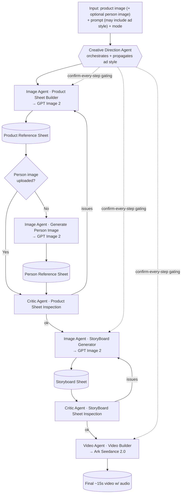

# AI Product Ad Video Generator — SPEC

> Living architecture document **and** progress tracker. Update the `- [ ]` checklists and the **Progress Log** as we build. Tick items off as they land.

---

## 1. Overview

Turns a **product image** (required) + an **optional person image** + a **text prompt** into a finished **~15-second advertisement video with audio**. The ad can be **any style** the user asks for — UGC, inspirational, cinematic, minimalist, luxury, comedic, etc. Agents read the user's intent and adapt; nothing assumes UGC.

Pipeline: **images → storyboard → video**, driven by cooperating AI agents that each carry their own skills and prompts. A Creative Direction Agent orchestrates the whole flow and propagates the requested ad style to every downstream agent. A Critic Agent validates artifacts and triggers regeneration. The final step sends the **full storyboard sheet** to Seedance 2.0, which produces **one** video with audio — there is no per-scene video building, no separate audio step, and no merge step.

---

## 2. Goals & Non-Goals

### Goals

- Accept product image (+ optional person image) + free-text prompt that **may** specify ad type/style/vibe.
- Two run modes: **Automatic** (end-to-end, no gating) and **Confirm-every-step** (user confirms each step).
- **Auto-checking in both modes**: Critic Agent validates each artifact and regenerates (full or partial) on issues.
- Style-agnostic: agents interpret requested style and adapt prompts/skills accordingly.
- Produce a single **~15s** ad video **with audio** as the final deliverable.
- Persist all artifacts + run state so a job survives a page refresh.

### Non-Goals

- ❌ Per-scene / per-keyframe video generation.
- ❌ Separate audio generation or an audio↔video merge step.
- ❌ Multiple output videos per run.
- ❌ Real-time / timeline video editing.
- ❌ Auth in early phases (deferred to **F8**).

---

## 3. Glossary

| Term                            | Meaning                                                                                                                      |
| ------------------------------- | ---------------------------------------------------------------------------------------------------------------------------- |
| **Scene**                       | A complete moment or section in the video.                                                                                   |
| **Keyframe**                    | A single important visual moment inside a scene.                                                                             |
| **Reference Sheet**             | A composite image of an entity (product or person) showing multiple views, used to keep downstream generations consistent.   |
| **Storyboard / Keyframe Sheet** | A single sheet describing the ordered scenes (camera/angle, action/movement, description) in the chosen ad style.            |
| **Run (Job)**                   | One end-to-end generation attempt for a project. The DB row is the state machine.                                            |
| **Step**                        | A discrete unit of the pipeline (product sheet, person sheet, product inspection, storyboard, storyboard inspection, video). |
| **Skill**                       | A named capability of an agent = a prompt module + a function the agent invokes.                                             |
| **Mode**                        | `automatic` or `confirm` — controls gating, not the auto-checks.                                                             |
| **Ad Style**                    | The interpreted creative direction (UGC / cinematic / minimalist / …) propagated to all agents.                              |

---

## 4. Architecture

### Agents, skills, services

| Agent                                       | Powered by                                                          | Skills                                                                                                                                                                                 |
| ------------------------------------------- | ------------------------------------------------------------------- | -------------------------------------------------------------------------------------------------------------------------------------------------------------------------------------- |
| **Creative Direction Agent** (orchestrator) | OpenAI (LLM)                                                        | Holds all guidelines + workflow logic. Decides agent order for both modes, interprets requested ad style, propagates it downstream, drives the run state machine, applies mode gating. |
| **Image Generation Agent**                  | OpenAI — **GPT Image 2** for images, OpenAI LLM for prompt building | `Product Sheet Builder`, `Generate Person Image`, `StoryBoard Generator`                                                                                                               |
| **Critic Agent** (QA/validation)            | OpenAI (LLM, vision)                                                | `Product Sheet Inspection` (full or localized partial regen), `StoryBoard Sheet Inspection`                                                                                            |
| **Video Generation Agent**                  | **Volcengine / BytePlus Ark — Seedance 2.0**                        | `Video Builder`                                                                                                                                                                        |

#### Skill detail

- **Product Sheet Builder** — decides the ad framework/hook from the product **and** the user's requested style, builds the final image prompt, calls GPT Image 2 → **Product Reference Sheet** (front, three-quarter, side, rear).
- **Generate Person Image** — **only** when no person image was uploaded. Defines the kind of person + how they fit the product/ad style, then generates the **Person Reference Sheet**.
- **StoryBoard Generator** — takes the product sheet (+ person sheet if present) → **Storyboard/Keyframe Sheet** of scenes, each with camera/angle, action/movement, scene description, consistent with the ad style.
- **Product Sheet Inspection** — validates the product sheet; regenerates the whole sheet, or **only the localized part**, when the problem is local.
- **StoryBoard Sheet Inspection** — validates the storyboard sheet; regenerates if problems.
- **Video Builder** — sends the **full storyboard sheet** to Seedance 2.0 → final ~15s video with audio. Final output; no merge.

### End-to-end flow



> Mode controls only the **gating** (the dotted lines): in `confirm` the run pauses at `awaiting_confirmation` after each step. Auto-checks (Critic) run in **both** modes.

### Execution model

- **Background worker + polling.** A Hono route enqueues a `run`; a background worker loop advances it step-by-step. The frontend polls a status endpoint. The `runs` row is the authoritative state machine, so a refresh never loses progress.
- **Assumption:** worker is an in-process loop in `apps/api` for F0–F7; revisit a dedicated queue (e.g. pg-boss) if scaling demands it.

### Agent/Skill code layout

Agents are **code, not a framework**. Each **skill** = a prompt module (`prompt.ts`) + a function (`index.ts`) of shape `(ctx: SkillContext, input) => Promise<SkillResult<T>>`. Provider adapters (OpenAI/Ark) are **injected via `SkillContext`**, never imported inside a skill — keeping skills swappable and testable.

```
apps/api/src/agents/
  types.ts                 SkillContext { runId, adStyle, openai }, SkillResult<T>
  json.ts                  parseJsonObject — pull strict JSON from an LLM reply
  image/                   Image Generation Agent (GPT Image 2) — F4
    index.ts               agent barrel (the 3 skills)
    persist.ts             shared: upload → assets row → artifact row (in a tx)
    product-sheet/         { prompt.ts, index.ts }  Product Sheet Builder
    person-image/          { prompt.ts, index.ts }  Generate Person Image
    storyboard/            { prompt.ts, index.ts }  StoryBoard Generator
    verify.ts              standalone skill runner (no worker until F7)
  critic/                  Critic Agent — F5 (reserved home)
  video/                   Video Generation Agent — F6 (reserved home)
  creative-direction/      Creative Direction Agent (orchestrator) — F7 (reserved home)
```

Each agent's prompts are written **inside that agent's own feature** (F4 Image, F5 Critic, F6 Video, F7 Creative Direction) — prompt and function are one unit, not a separate phase. The Creative Direction Agent (F7) wires the skills into the run state machine; until then skills are invoked directly via `verify.ts`.

---

## 5. Data Model & Artifact Schemas

**ORM:** Drizzle over **Supabase Postgres**. **Validation:** Zod mirrors live in `packages/shared` and are reused by API + frontend. **Files:** Supabase Storage; DB rows hold object path + URL.

### Tables

#### `projects`

| Field     | Type          | Notes                |
| --------- | ------------- | -------------------- |
| id        | uuid PK       |                      |
| ownerId   | uuid nullable | null until Auth (F8) |
| title     | text          |                      |
| createdAt | timestamptz   |                      |

#### `runs` (generation job)

| Field                 | Type                          | Notes                                                                               |
| --------------------- | ----------------------------- | ----------------------------------------------------------------------------------- |
| id                    | uuid PK                       |                                                                                     |
| projectId             | uuid FK → projects            |                                                                                     |
| prompt                | text                          | raw user prompt                                                                     |
| adStyle               | text                          | interpreted style propagated to agents                                              |
| mode                  | enum `automatic` \| `confirm` |                                                                                     |
| status                | enum                          | `queued`, `running`, `awaiting_confirmation`, `regenerating`, `completed`, `failed` |
| currentStep           | enum (see Steps)              |                                                                                     |
| error                 | text nullable                 |                                                                                     |
| createdAt / updatedAt | timestamptz                   |                                                                                     |

**Steps enum:** `product_sheet`, `person_sheet`, `product_inspection`, `storyboard`, `storyboard_inspection`, `video`.

#### `assets`

| Field       | Type           | Notes                                                                                                 |
| ----------- | -------------- | ----------------------------------------------------------------------------------------------------- |
| id          | uuid PK        |                                                                                                       |
| runId       | uuid FK → runs |                                                                                                       |
| kind        | enum           | `product_upload`, `person_upload`, `product_sheet`, `person_sheet`, `storyboard_sheet`, `final_video` |
| storagePath | text           | Supabase Storage object path                                                                          |
| url         | text           | public or signed URL                                                                                  |
| mime        | text           |                                                                                                       |
| meta        | jsonb          | width/height/duration/provider info                                                                   |
| createdAt   | timestamptz    |                                                                                                       |

#### `step_events` (audit trail)

| Field     | Type           | Notes                                       |
| --------- | -------------- | ------------------------------------------- |
| id        | uuid PK        |                                             |
| runId     | uuid FK → runs |                                             |
| step      | enum (Steps)   |                                             |
| status    | text           | started / passed / failed / regenerated     |
| payload   | jsonb          | Critic diagnostics, prompts used, decisions |
| createdAt | timestamptz    | drives progress timeline                    |

### Canonical artifacts

#### Product Reference Sheet — `product_reference_sheets`

4 product views in one composite sheet.

| Field      | Type                               | Notes                                                                        |
| ---------- | ---------------------------------- | ---------------------------------------------------------------------------- |
| id         | uuid PK                            |                                                                              |
| runId      | uuid FK                            |                                                                              |
| assetId    | uuid FK → assets (`product_sheet`) |                                                                              |
| views      | jsonb                              | `{ front, threeQuarter, side, rear }` — each: crop/region descriptor + notes |
| promptUsed | text                               | final GPT Image 2 prompt                                                     |
| status     | text                               | `draft` / `approved` / `rejected`                                            |

#### Person Reference Sheet — `person_reference_sheets`

Multiple views + person details, costume/style, color reference. Only created when no person uploaded.

| Field         | Type                              | Notes                                            |
| ------------- | --------------------------------- | ------------------------------------------------ |
| id            | uuid PK                           |                                                  |
| runId         | uuid FK                           |                                                  |
| assetId       | uuid FK → assets (`person_sheet`) |                                                  |
| views         | jsonb                             | multiple view descriptors                        |
| personDetails | jsonb                             | `{ demographics, costumeStyle, colorReference }` |
| promptUsed    | text                              |                                                  |
| status        | text                              | `draft` / `approved` / `rejected`                |

#### Storyboard / Keyframe Sheet — `storyboard_sheets`

Ordered scenes, each with camera/angle, action/movement, description, in the chosen ad style.

| Field      | Type                                  | Notes                                                                     |
| ---------- | ------------------------------------- | ------------------------------------------------------------------------- |
| id         | uuid PK                               |                                                                           |
| runId      | uuid FK                               |                                                                           |
| assetId    | uuid FK → assets (`storyboard_sheet`) |                                                                           |
| scenes     | jsonb[]                               | each: `{ index, cameraAngle, actionMovement, sceneDescription, adStyle }` |
| promptUsed | text                                  |                                                                           |
| status     | text                                  | `draft` / `approved` / `rejected`                                         |

#### Final Video — `videos`

Single ~15s clip with audio from Seedance 2.0. No merge.

| Field        | Type                             | Notes                                 |
| ------------ | -------------------------------- | ------------------------------------- |
| id           | uuid PK                          |                                       |
| runId        | uuid FK                          |                                       |
| assetId      | uuid FK → assets (`final_video`) |                                       |
| durationSec  | numeric                          | ~15                                   |
| hasAudio     | boolean                          | true (native Seedance audio)          |
| providerMeta | jsonb                            | Ark task id, model slug, params       |
| status       | text                             | `processing` / `completed` / `failed` |

---

## 6. External Integrations

| Service                         | Used for                                                                               | Client                                       | Key (env)                                                                        |
| ------------------------------- | -------------------------------------------------------------------------------------- | -------------------------------------------- | -------------------------------------------------------------------------------- |
| **OpenAI**                      | GPT Image 2 (all image artifacts) **and** agent LLM reasoning/prompt-building/critique | `openai` SDK                                 | `OPENAI_API_KEY`                                                                 |
| **Ark** (Volcengine / BytePlus) | Seedance 2.0 video (full storyboard sheet → ~15s video w/ audio)                       | Ark REST (OpenAI-compatible client)          | `ARK_API_KEY`                                                                    |
| **Supabase**                    | Postgres DB (via Drizzle) + Storage + Auth (F8)                                        | `@supabase/supabase-js` + `postgres`/Drizzle | `SUPABASE_URL`, `SUPABASE_ANON_KEY`, `SUPABASE_SERVICE_ROLE_KEY`, `DATABASE_URL` |

**Config location:** env loaded + Zod-validated in `apps/api/src/config` (server secrets) and `apps/web` env (public-safe vars only). Provider calls live behind a thin **adapter boundary** (`apps/api/src/providers/{openai,ark}`) so the concrete model/provider is swappable without touching agent logic.

**Invocation shape:**

- GPT Image 2 — Image Agent builds a prompt (via LLM skill) → image generation call → store composite sheet to Supabase Storage → row in `assets` + artifact table.
- Seedance 2.0 — Video Builder submits the full storyboard sheet (image + text) as an Ark video task, polls Ark until complete, downloads the ~15s video to Supabase Storage.

---

## 7. Mode Behavior

|                      | Automatic                               | Confirm-every-step                                                                                                           |
| -------------------- | --------------------------------------- | ---------------------------------------------------------------------------------------------------------------------------- |
| Step gating          | None — worker advances straight through | Worker sets `awaiting_confirmation` after each step's artifact is produced + auto-checked; waits for user `confirm`/`reject` |
| Auto-checks (Critic) | ✅ runs, auto-regenerates on issues     | ✅ runs, auto-regenerates on issues (same)                                                                                   |
| User actions         | Cancel only                             | Confirm step / Reject step (→ regenerate) / Cancel                                                                           |
| Resume after refresh | Worker continues                        | Run sits in `awaiting_confirmation`; UI re-renders the pending step                                                          |

State machine: `queued → running → (regenerating ⇄ running) → [awaiting_confirmation only in confirm mode] → … → completed | failed`. Critic-driven regeneration is independent of mode and bounded by a retry cap (see Open Questions).

---

## 8. Open Questions / Assumptions

**Open questions**

- Exact OpenAI model id/endpoint mapped to "GPT Image 2", and whether a reference "sheet" is **one composite image** (multiple views in a grid) vs several separate images. **Assumption:** one composite sheet image per artifact.
- Exact Ark **Seedance 2.0 model slug/endpoint**, whether it accepts the storyboard as a single image + text prompt, and confirmation of **native audio** output.
- Agent runtime: OpenAI Responses/Chat + tool-calling vs Assistants API; how "skills" map to code. **Assumption:** each skill = a prompt module + a function, orchestrated in code by the Creative Direction Agent.
- Worker host: in-process loop vs separate queue process (pg-boss/BullMQ). **Assumption:** in-process loop in `apps/api` through F7.
- Regeneration **retry caps / cost guards** — max auto-regens per step before failing the run.
- Storage **bucket layout, signed-URL strategy, retention** policy.
- Whether projects are reusable across many runs or 1 run = 1 project in the MVP. **Assumption:** project can hold multiple runs; UI starts with one run per project.

**Assumptions** (recorded above inline) — all marked **Assumption:** are working defaults, revisit as needed.

---

# Features (build order — progress tracker)

> Tick `- [ ]` → `- [x]` as items complete. Keep this section authoritative.

## F0 — Project scaffolding & config

**Goal:** add all missing deps and a validated config/secret layer on top of the existing monorepo.

- [x] Add deps: `zod` (shared + api), `drizzle-orm` + `drizzle-kit` + `postgres` (api), `@supabase/supabase-js` (api), `zustand` + `framer-motion` (web)
- [x] Per-app env files: `apps/api/.env(.example)` holds server secrets (`OPENAI_API_KEY`, `ARK_API_KEY`, `SUPABASE_URL`, `SUPABASE_ANON_KEY`, `SUPABASE_SERVICE_ROLE_KEY`, `DATABASE_URL`); `apps/web/.env.local(.example)` holds public-only `NEXT_PUBLIC_*` (`NEXT_PUBLIC_API_URL`, `NEXT_PUBLIC_SUPABASE_URL`, `NEXT_PUBLIC_SUPABASE_ANON_KEY`). Real files gitignored, `.example` pushed.
- [x] `apps/api/src/config` — load + Zod-validate server env (fail fast on missing secrets)
- [x] `apps/web` public env handling (only `NEXT_PUBLIC_*` exposed)
- [x] Shared enums/types (run status, step, asset kind, mode, artifact status) in `packages/shared` as Zod schemas + inferred types
- [x] Provider adapter stubs: `apps/api/src/providers/{openai,ark}` interfaces
- [x] Confirm `pnpm dev`, `typecheck`, `lint` still green

## F1 — Database schema design

**Goal:** Drizzle schema over Supabase Postgres + migrations for all tables/artifacts.

- [x] Drizzle schema: `projects`, `runs`, `assets`, `step_events`
- [x] Drizzle schema: `product_reference_sheets`, `person_reference_sheets`, `storyboard_sheets`, `videos`
- [x] Enums: run status, step, asset kind, mode, artifact status
- [x] `drizzle.config.ts` pointed at `DATABASE_URL`
- [x] Generate + apply initial migration to Supabase
- [x] DB client singleton in `apps/api/src/db`
- [x] Seed/test helper for a sample run
- [x] RLS enabled on all tables (locked down, service-role-only; owner-based policies deferred to F8)
- [x] Schema + RLS docs in `apps/api/docs/`

## F2 — Frontend UI shell + TanStack Query

**Goal:** input + progress UI; no real generation yet (mock the API).

- [x] Upload product image (required) + optional person image, with preview
- [x] Prompt textarea (style hint allowed)
- [x] Mode toggle: Automatic / Confirm-every-step
- [x] Create button → calls create-run API (mocked via server action)
- [x] Results/progress view: per-step status, artifact previews, confirm/reject buttons (confirm mode)
- [x] State convention: **no global store** (zustand removed). Form draft = local `useState`/`useReducer`; server state (run status, artifacts) = **TanStack Query** via a `<Providers>` `QueryClientProvider` (`apps/web/src/app/providers.tsx`). Poll `GET /runs/:id` with `refetchInterval`, stopping at terminal status (`completed`/`failed`). React Context only if a real cross-cutting need appears (e.g. toasts).
- [x] Framer Motion transitions between steps/states
- [x] Apply `frontend-design`, `tailwindcss`, `framer-motion` skills for the UI

## F3 — Backend API (Hono) + Zod

**Goal:** routes to create runs, poll status, fetch artifacts, and gate steps.

- [x] `POST /runs` — create run (multipart: images + prompt + mode), upload images to Supabase Storage, insert rows, enqueue
- [x] `GET /runs/:id` — status + currentStep + step_events
- [x] `GET /runs/:id/artifacts` — sheets + video URLs
- [x] `POST /runs/:id/confirm` and `POST /runs/:id/reject` — confirm-mode gating (+ `POST /runs/:id/cancel`)
- [x] Zod validation on every route (shared schemas)
- [x] Supabase Storage upload helpers (public bucket `ugc-assets` → stable public URLs; signed URLs deferred — bucket is public for now)
- [x] Error handling + consistent JSON error shape

## F4 — Image Generation Agent + skills (GPT Image 2)

**Goal:** produce product sheet, optional person sheet, storyboard sheet.

- [x] OpenAI provider adapter (LLM + GPT Image 2 image gen)
- [x] Skill: **Product Sheet Builder** — style/hook reasoning → prompt → GPT Image 2 → Product Reference Sheet (4 views)
- [x] Skill: **Generate Person Image** — only when no person uploaded → Person Reference Sheet (+ personDetails)
- [x] Skill: **StoryBoard Generator** — product (+person) sheet → Storyboard Sheet (scenes)
- [x] Persist artifacts to Storage + artifact tables + `assets`
- [x] Each skill = prompt module + function; ad style threaded through

## F5 — Critic Agent + skills

**Goal:** validate artifacts and regenerate (full or partial) on issues, in both modes.

- [ ] Skill: **Product Sheet Inspection** — vision validation; full regen
- [ ] Product Sheet Inspection — **localized partial regen** when the problem is local
- [ ] Skill: **StoryBoard Sheet Inspection** — validate scenes; regenerate on problems
- [ ] Write `step_events` diagnostics for each inspection
- [ ] Retry cap / cost guard before failing a run

## F6 — Video Generation Agent + Video Builder (Seedance 2.0)

**Goal:** storyboard sheet → single ~15s video with audio. No merge.

- [ ] Ark provider adapter (submit + poll Seedance 2.0)
- [ ] Skill: **Video Builder** — send full storyboard sheet → ~15s video w/ audio
- [ ] Download result to Supabase Storage; insert `videos` + `assets`
- [ ] Surface final video in results view

## F7 — Creative Direction Agent orchestration + modes

**Goal:** the orchestrator + background worker that runs the whole state machine for both modes.

- [ ] Creative Direction Agent: workflow logic, agent sequencing, ad-style interpretation + propagation
- [ ] Background worker loop polling `runs` and advancing steps
- [ ] Automatic mode: end-to-end, no gating
- [ ] Confirm mode: pause at `awaiting_confirmation`, resume on confirm/reject
- [ ] Full state-machine transitions incl. regeneration + failure
- [ ] End-to-end run verified with both modes

## F8 — Auth (Supabase) + hardening + cleanup

**Goal:** attach ownership, secure access, final polish. **Deferred to last.**

- [ ] Supabase Auth (sign-in)
- [ ] Set `projects.ownerId`; scope runs/artifacts to the user
- [ ] Row-Level Security policies
- [ ] Secret review + rate limiting + input hardening
- [ ] Cleanup, error states, retention policy for assets

---

## Progress Log

### 2026-05-30

- SPEC.md created — architecture, data model, integrations (OpenAI + Ark/Seedance + Supabase), mode behavior, and feature checklists F0–F8 captured. No application code yet.
- **F0 complete.** Deps added (`zod`, `drizzle-orm`/`drizzle-kit`/`postgres`, `@supabase/supabase-js`, `dotenv` on api; `zustand`/`framer-motion` on web). Per-app env files (`apps/api/.env(.example)` server secrets, `apps/web/.env.local(.example)` `NEXT_PUBLIC_*` only); real files gitignored. Video provider switched **fal.ai → Volcengine/BytePlus Ark** (`ARK_API_KEY`) across SPEC + CLAUDE.md. Built: `apps/api/src/config` (Zod env, fail-fast), `apps/web/src/lib/env.ts` (public-only), shared Zod enums (`packages/shared/src/enums.ts`), provider stubs `apps/api/src/providers/{openai,ark}`. typecheck + lint + api boot all green.
- **F1 complete.** Drizzle schema for all 8 tables in `apps/api/src/db/schema.ts` (5 native `pgEnum`s sourced from the shared Zod enums; PKs `gen_random_uuid()`, FKs `ON DELETE cascade`, indexes on every FK + `runs.status`, CHECKs on `step_events.status`, `videos.status`, `videos.duration_sec > 0`). `drizzle.config.ts` + `db:generate/migrate/push/seed/studio` scripts. Initial migration `0000_silky_the_watchers.sql` generated and **applied to live Supabase** (verified: 8 tables, `relrowsecurity=true` on all, 5 enums, 3 checks present). DB client singleton `apps/api/src/db/index.ts` (first consumer of `src/config`). Seed helper inserts + reads back a sample run. **RLS** enabled on every table with **no policies** — locked-down/service-role-only until Auth (F8). Docs: `apps/api/docs/{database-schema,rls-policies}.md`.
- **F2 complete.** Frontend UI shell + TanStack Query, with a marketing **landing page** (`/`), **studio** create form (`/studio`), and **run progress** view (`/studio/[runId]`). Stack added: **shadcn/ui** (new-york, generated `components/ui/*`), **next-themes** dark/light/system toggle, **lucide-react**, `tw-animate-css`; `globals.css` reworked to an oklch token theme with a custom violet→fuchsia→cyan **brand** accent. Shared **DTO schemas** added (`packages/shared/src/dto.ts`: `Run`/`Asset`/`StepEvent`/`RunDetail`/`CreateRunInput`, reusing the F0 enums). **Backend mocked**: an in-memory run state machine (`apps/web/src/lib/mock/store.ts`) advanced on each poll, exposed as **server actions** (create/confirm/reject/cancel in `app/studio/actions.ts`) + a **route handler** poll target (`app/api/runs/[runId]/route.ts`) — same `RunDetail` contract as F3 so only the data layer swaps later. Create = structured form (dropzones w/ preview, segmented mode field with visible selection chips, prompt textarea). Progress = vertical **timeline/stepper** (per-step status badges, artifact cards w/ zoom dialog, confirm-bar gating in confirm mode, terminal video/error states), Framer Motion throughout + `prefers-reduced-motion`. Polling stops at terminal status and pauses at `awaiting_confirmation`. Placeholder artifacts in `public/mock/`. **Tooling fix:** Turbopack couldn't resolve the shared barrel's `./*.js` (TS-style) re-exports, so `packages/shared` internal re-exports are now extensionless and `apps/api/tsconfig.json` moved `NodeNext` → `module: ESNext` + `moduleResolution: Bundler` (the standard config for consuming a raw-TS workspace package); `apps/web/next.config.ts` adds `transpilePackages: ["@ugc/shared"]`. Verified: `pnpm --filter @ugc/shared|api typecheck`, `api` tsc emit, `web` lint + `next build` all green; landing/studio/route-handler render (200 / 404); full state machine exercised (automatic completes + skips `person_sheet` when no person image; confirm gates → reject regenerates → confirm advances; cancel → failed). Auth/real generation still deferred to later features.
- **F3 complete (API surface).** Hono backend built in `apps/api`: `app.ts` (CORS for `localhost:3000`, `/health`, mounts `/runs`, `onError`/`notFound` sinks) + slimmed `index.ts` (serve on `env.PORT`). Routes in `src/routes/runs.ts`: `POST /runs` (multipart via `c.req.parseBody()`; validates files — png/jpeg/webp, ≤10MB — and text via shared `createRunInputSchema`; auto-creates a `projects` row since `runs.projectId` is NOT NULL; uploads to Storage; inserts `assets`), `GET /runs/:id`, `GET /runs/:id/artifacts` (lean shape: sheets/video by asset kind + `videos` row, `numeric` durationSec coerced), `POST /runs/:id/{confirm,reject,cancel}`. Helpers: `lib/errors.ts` (`ApiError` + factories + single JSON error shape `{error,code?,details?}`), `lib/storage.ts` (service-role Supabase client, **public** `ugc-assets` bucket, `uploadAsset`/`getPublicUrl`, path `runs/{runId}/{kind}-{uuid}.{ext}`), `lib/mappers.ts` (sole DB→DTO exit; coalesces nullable→required, **never emits `storagePath`** or artifact-table internals), `lib/runs.ts` (`loadRunDetail`, `getRunOr404` w/ uuid pre-validation, `assertStatus`). Added `src/storage/setup.ts` + `storage:setup` script (idempotent bucket create). **Decisions:** public bucket (stable URLs, no re-signing); confirm/reject are strict (409 until F7 sets `awaiting_confirmation`); no worker/agents yet so created runs stay `queued`; cancel is idempotent. Verified live: typecheck green; server boots; 16 curl cases pass (create 201 + uploaded files publicly fetchable, GET 200, artifacts all-null for fresh run, confirm/reject 409 on queued, bad/missing uuid 404, missing-image 422, empty-prompt/bad-mode 400, unsupported-type 422, cancel→failed + idempotent, CORS preflight 204, automatic mode skips `person_upload`). **Frontend NOT yet wired** — still on the F2 mock; cutover is a follow-up after Postman validation. No agent/skill prompts written (those start at F4).
- **State/deps decision.** Removed `zustand` from `apps/web` — the app is server-state-heavy (the `runs` row is authoritative; `runId` is a route param), so there's no genuine cross-tree client state to justify a global store. Adopted **TanStack Query** (`@tanstack/react-query`) for all server state + polling; wired a client `<Providers>` (`apps/web/src/app/providers.tsx`) into the root layout. Form draft stays in local component state; React Context reserved for future cross-cutting concerns only. **Zod kept as-is** — enums are single-sourced in `packages/shared` (`z.enum`) and Drizzle `pgEnum`s derive values via `.options` (zero duplication); Zod earns its runtime keep at API-route + config validation, which Drizzle enums can't do. Dependency direction (`api` → `shared`, never reverse) means enums/DTOs must live in `shared`, so drizzle-as-source / `drizzle-zod` were rejected.
- **F4 complete (code; live-API verification pending).** Image Generation Agent + 3 skills built under `apps/api/src/agents/`. **Agent/skill convention** (now documented in §4 "Agent/Skill code layout"): each skill = `prompt.ts` (prompt module) + `index.ts` (function `(ctx: SkillContext, input) => SkillResult<T>`); the OpenAI adapter is **injected via `SkillContext`**, never imported in a skill. **OpenAI provider** (`providers/openai/index.ts`) stub filled in — interface unchanged: `chat()` via Chat Completions (vision-ready: `ChatMessage.images` → `image_url` parts, reused by F5), `generateImage()` branches `images.generate` (no refs) vs `images.edit` (refs → `toFile`, reference path for product→sheet); model ids isolated in `providers/openai/constants.ts` (`OPENAI_CHAT_MODEL=gpt-4.1`, `OPENAI_IMAGE_MODEL=gpt-image-1` as the GPT-Image-2 stand-in, `DEFAULT_IMAGE_SIZE=1536x1024`). Skills: **Product Sheet Builder** (edit path w/ product upload ref → `product_reference_sheets`), **Generate Person Image** (caller-gated to no-person-uploaded; refs the product sheet → `person_reference_sheets`), **StoryBoard Generator** (refs product + optional person sheet → `storyboard_sheets`, scenes tagged with `adStyle`). All sheets are **single composite images** (SPEC working assumption). Shared `image/persist.ts` (upload → `assets` row → artifact row in one `db.transaction`) and `agents/json.ts` (`parseJsonObject` strips ```json fences). `adStyle` threaded opaque via `ctx` (interpretation is F7's job). **No worker wiring** (F7) — skills invoked by `agents/image/verify.ts` (`pnpm --filter api agents:verify <runId> ["style"]`, hits live OpenAI). `pnpm --filter api typecheck` green; added `openai@^6.39.1`. **Not yet run against the live OpenAI image API** — flagged open: exact GPT-Image-2 slug, `images.edit` multi-reference support (storyboard passes 2 refs), composite-sheet layout/label quality (fallback: per-view gen + `sharp` stitch).
